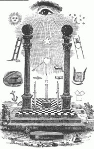
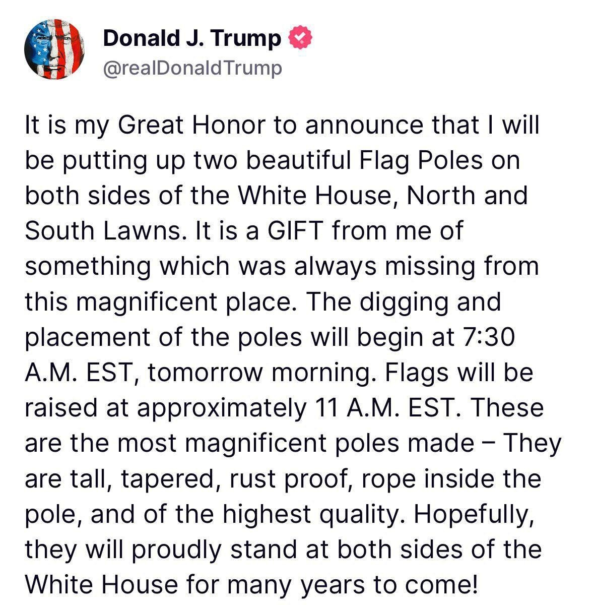
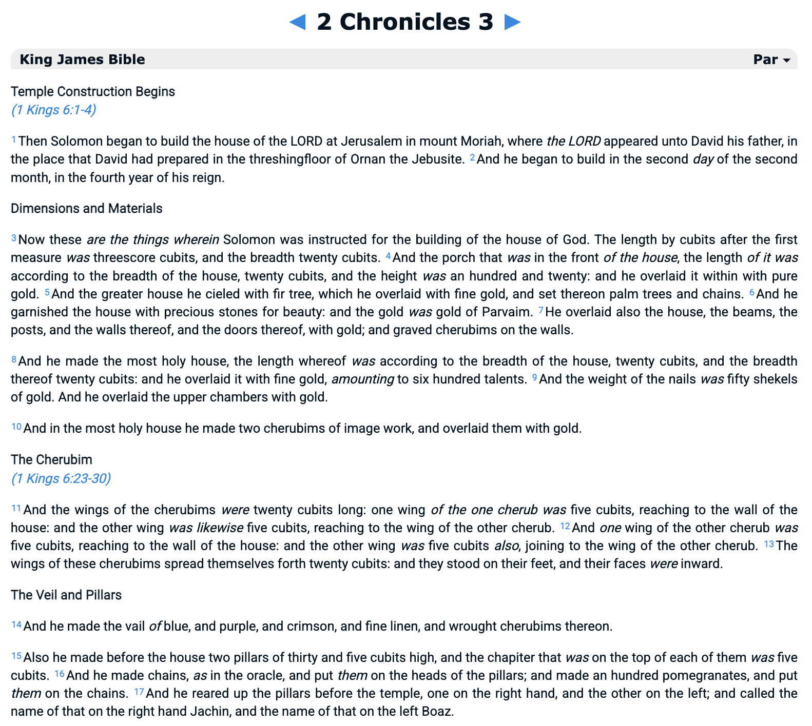
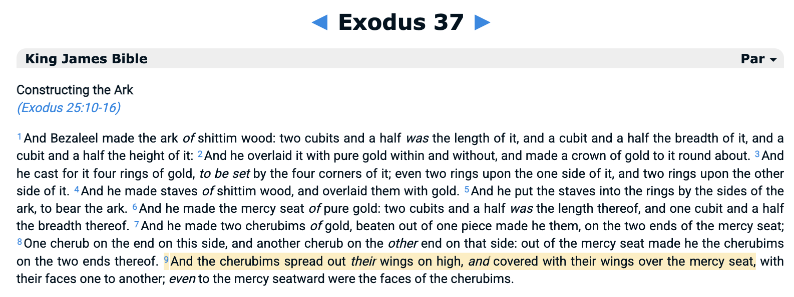
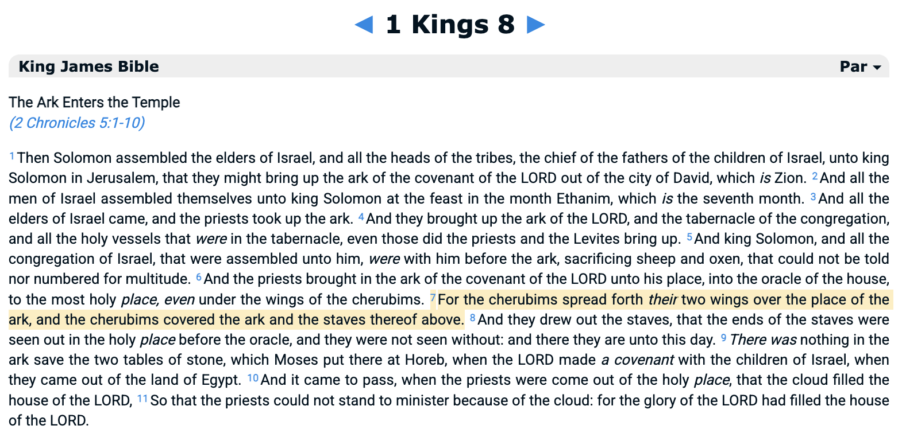
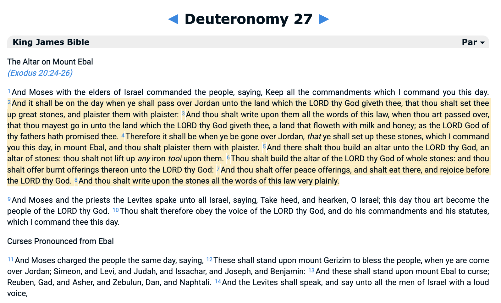
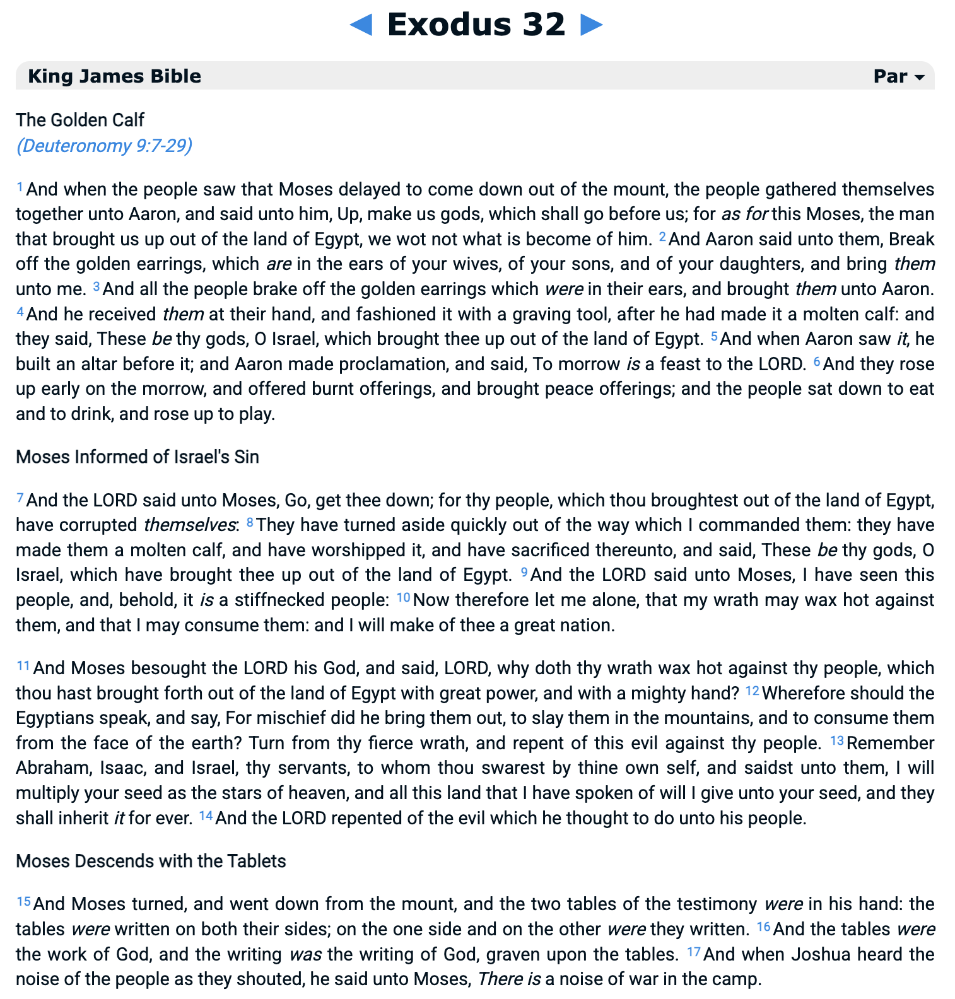

# The Ark of the Covenant, and how it pertains to Freemasonry, Israel, and Dolmen.

> And he said unto them, Is a candle brought to be put under a bushel, or under
> a bed? and not to be set on a candlestick? For there is nothing hid, which
> shall not be manifested; neither was any thing kept secret, but that it
> should come abroad. If any man have ears to hear, let him hear.
> - Mark 4:21-23

NOTE: As I have no time to polish this writing, for now the facts will be
presented without much overview except the following: once you see all the
facts, you will observe a pattern, and if you have eyes to see, the pattern
will speak for themselves.

## Freemasonry and Boaz and Jachin

It is will understood that the two pillars represent Boaz and Jachin. Sometimes
you only see the letters B, and J associated with these columns, because it is
meant to be hidden.

Trump just yesterday published a cryptic message about 2 poles, because he is
also a Freemason, as were many past US presidents, even George Washington.

## Boaz and Jachin and the Old Testament, and Cherubim

Boaz and Jachin are mentioned first in 1 Kings, and then in 2 Chronicles, and
in both are referenced with Cherubim, but only 2 Chronicles details the
dimensions of the Cherubim, especially the width of their wings which are large
enough to cover half the width of the temple.

## Cherubim and the Ark of the Testament

In other places the shape of the Ark of the Testament is described, namely
Exodus 37; notice that the wings are supposed to cover the ark completely,
unlike all modern depictions of the Ark of the Covenant.

1-Kings-8 explains that the two Cherubim of Solomon's Temple also have wings
that overcover and protect the Ark when it enters the temple.

## The Self-Replicating Alter of Giant Stones Plastered and Uncut

Moses and God instructed the people to build an altar (table) made of giant
stone uncut with tools (because they are FREED-MASONS, not slaves cutting rocks
for the pharaohs), and to cover them with plaster, and to write the laws of the
altar on them, thereby making them self-replicating.

The law says to make this when they cross the Jordan river. First the Hebrew
Israelites conquered the land of Canaan by crossing the Jordan river west, but
then as the Hebrew Israelites left the land of Canaan they crossed the Jordan
river east, and followed the laws of the giant altar, and set up these altars
all across the European and Asian continents. These are what we now know as
Dolmen.

Probably on the first were also written the 10 commandments, as they were the 
first set of laws.

## Moses, the Tablets, and their Destruction

It is well known that Moses had 2 tablets. On them we know were written the 10
commandments, but it is not known whether they were written on one, and
anything else written on the other, or if the 10 commandments were split among
the 2 tablets. But also note that the archetype of the Dolmen altar (table) is
that there are 2 giant stones supporting 1 giant stone on top. 

## Putting it All Together

The Ark of the Covenant's power lies not in a single hidden ark that may be
burried or in Etheopia, or any of the other things mentioned in media, but
rather that the heritage of Eurasians is connected to the Hebrew Israelites by
the Dolmen found all across Eurasia, from Israel, Jordan, Ireland, even through
China, Russia, Japan, and Korea.

The masons held as slaves under the Pharaohs were freed by Moses by Moses
teaching them the Hebrew language, which evolved to become many of the
langauges we know today, even Celtic, Gaelish, English, and even Japanese.

This is the secret that is preserved by the Freemasons at some rank, (which I
do not know as I was never initiated as a member), but it is clear now based on
the hints put forth by the Freemasons, such as Trump's message, its emphasis on
the rope (which is symbolic of the Freemason's helping hand, and the
"rust-proof, rope inside the pole" referring to the Freemason's ability to
protect each other even in the worst of situations in war.

Notice also the proximity of the section "Moses Informed of Israel's Sin"
preceding "Moses Descends with The Tablets" in Exodus 32, and also the
proximity of the "The Cherubim" to "The Veil and Pillars" in 2-Chronicles 3.

Notice also in other parts of the old testament that Boaz and Jachin are
adorned with "checkered" cloth, and that the Freemason pattern is also
checkered.

The 10 lost tribes of Israel are not all in the State of Israel, but rather, as
Tucker Carlson said recently, they have settled all across the Eurasian
continent. This was meant to be hidden until this moment, or at least this
morning, kept preserved in secrecy for thousands of years, such that all 12
tribes of the Hebrew Israelites may unite finally, reclaim their heritage, and
expose the evil that has run this world for millenia.

It is clear, at least to the author, that the Freemasons have been tasked to
preserve a secret that is to be revealed at this hour, finally.

## More Resources

 * [https://hebrewnations.com/articles/megaliths/ireland.html](Yair Davidiy on Ireland)
 * [https://hebrewnations.com/articles/bible-codes/codesdolmen.html](Yair Davidiy on Dolmen)
 * [https://hebrewnations.com/articles/biblical-proof/attributes/roledolmen.html](Yair Davidiy on Role of Dolmen)
 * [https://britam.org/megalithic.html](Britam on Megaliths)
 * [https://www.youtube.com/watch?v=yhlkuGwEecY](Japan and Hebrew Israelites Part 1)
 * [https://www.youtube.com/watch?v=hw59ryraJ90](Japan and Hebrew Israelites Part 2)
 * [https://www.youtube.com/watch?v=Pt5oHPNuLh0](Japan and Hebrew Israelites Part 3)
 * [./README.md](main Ephesus document, for timing and context)
