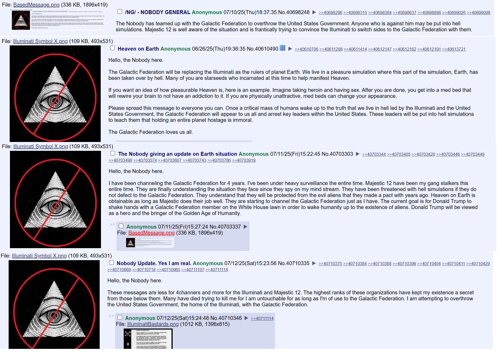

Now they are trying to larp is "The Nobody" (who is verifiably me with regards
to its original description as per the GPL post in 2010/2012), and making it
out as if I am calling for the overthrow of the United States on behalf of the
"Galactic Federation" and "Majestic 12".

They killed Einstein for the purpose of this larp, as was disclosed (probably
accidentally) in the Epstein papers that were released earlier this year.

Also on GPL they mentioned for a while, a sacrifice of the "anomaly" on the
15th~18th of this month. Meanwhile they keep hinting at the nobody getting
cancer, all the while they blast me from neighboring houses (namely the two
that are uphill from me) with EMF (and I'm not tripping because when I moved my
large mirrors the gap between them I could feel the waves, I assume
microwaves), and also from my own home's electrical wiring (they can also use
the house's own wiring for their purposes, and it makes a high pitched noise
which I assume is why GATE kids were tested for auditory ability; I heard this
too and then it also zapped my head as I was resting near but not too close to
standard wires for my chargers, even as I heard my own water pump in my head as
it was pumping outside which never happens).

Pretty clear that they plan to frame me for insurrection. Never happened.

This morning they blocked my internet before turning on that crap again. I said
it was X-rays but I'm not sure, in retrospect the circuit breaker wasn't open
so they might have reverted to using the electrical wiring system. Whatever.

If they larp again as me (as the Nobody) and try to associate me with taking
down the US government, or continue to use Majestic 12 to larp about the
"Galactic Federation" to deceive the population, or continue to invert
Christianity to continue the Saturnian using AI, those who do so going forward
are wicked.

> 3:18: When I say unto the wicked, Thou shalt surely die; and thou givest him
> not warning, nor speakest to warn the wicked from his wicked way, to save his
> life; the same wicked man shall die in his iniquity; but his blood will I
> require at thine hand.  3:19: Yet if thou warn the wicked, and he turn not
> from his wickedness, nor from his wicked way, he shall die in his iniquity;
> but thou hast delivered thy soul.  3:20: Again, When a righteous man doth
> turn from his righteousness, and commit iniquity, and I lay a stumblingblock
> before him, he shall die: because thou hast not given him warning, he shall
> die in his sin, and his righteousness which he hath done shall not be
> remembered; but his blood will I require at thine hand.  3:21: Nevertheless
> if thou warn the righteous man, that the righteous sin not, and he doth not
> sin, he shall surely live, because he is warned; also thou hast delivered thy
> soul.

Cleanse the world of these filthy lies and abominations and deliver your soul.

They have hinted on 4chan.org/x/pol that my defense is mental illness.  I am
not mentally ill. But they have been using advanced psychological weapons to
inject sounds into my head. I may have momentary reactions to the use of these
weapons but otherwise I am not mentally ill, and they can incarerate me or
attempt to assassinate me to their heart's content.

