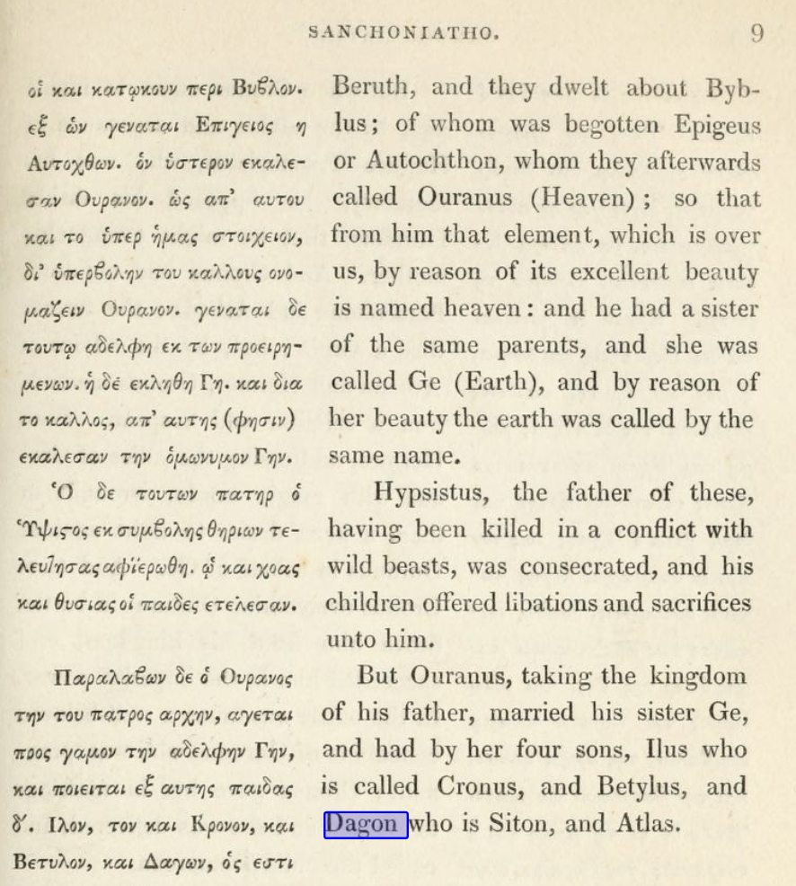
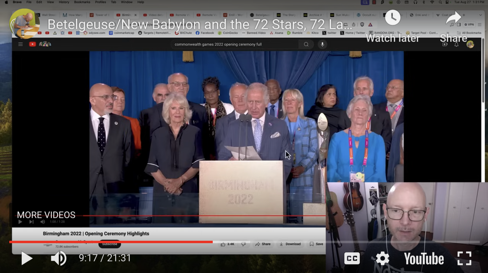
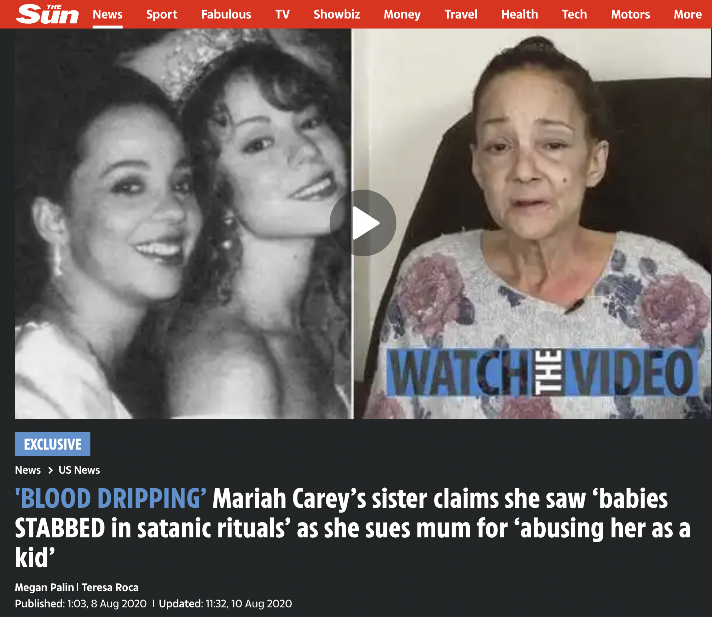

> Our Father which art in heaven, Hallowed be thy name.  Thy kingdom come. Thy
> will be done in earth, as it is in heaven.  Give us this day our daily bread.
> And forgive us our debts, as we forgive our debtors.  And lead us not into
> temptation, but deliver us from evil: For thine is the kingdom, and the
> power, and the glory, for ever. Amen.
> - the Lord's Prayer, Matthew 6:9 (KJV)

# Prerequisites

First you must understand the differences between the following books:

 * **Torah == Pentateuch**: the first five books of the Hebrew scriptures and
   Christian bible. Commonly attributed to Moses, which would imply authorship
   in the 2nd millenium BCE, but this is contentious.
 * **Old Testament**: the Torah/Pentateuch plus books from the prophets, Kings
   David and Solomon, priests, and scribes. Altogether the Old Testmanet was
   completed hundreds of years before Jesus. These books were originally
   written in Hebrew.
 * **New Testament**: all the books of the New Testament were written some time
   after Jesus, probably between 50 CE and 120 CE. The Old Testament and New
   Testament comprise the Christian Bible, although the total number of books
   differ depending on the version. These books were originally written in
   Koine Greek. The first four books are known as the Gospels, or Good News.
   _The King James Version (KJV) is perhaps the most faithful in English,
   though it is not without faults._
 * **Babylonian Talmud**: compiled by scholars in Babylonia around 500 CE, based on
   the Mishnah (written oral traditions) which was first written roughly in the
   3rd century CE. The Babylonian Talmud is not part of the Christian Bible.
   _Some Jews such as the Karaites maintain that all of the divine commandments
   handed down to Moses by God were recorded in the written Torah without
   additional Oral Law or explanation. As a result, Karaite Jews do not accept
   as binding the written collections of the oral tradition in the Midrash or
   Talmud. The Karaites comprised a significant portion of the world Jewish
   population in the 10th and 11th centuries CE, and remain extant, although
   they currently number in the thousands._ 

# Why Jesus Spoke in Parables

> And the disciples came, and said unto him, **Why speakest thou unto them in
> parables**?  He answered and said unto them, Because it is given unto you **to
> know the mysteries of the kingdom of heaven, but to them it is not given**.
> For whosoever hath, to him shall be given, and he shall have more abundance:
> but whosoever hath not, from him shall be taken away even that he hath.
> Therefore speak I to them in parables: **because they seeing see not; and
> hearing they hear not, neither do they understand.** And in them is fulfilled
> the prophecy of Esaias, which saith, By hearing ye shall hear, and shall not
> understand; and seeing ye shall see, and shall not perceive: For this
> people's heart is waxed gross, and their ears are dull of hearing, and their
> eyes they have closed; lest at any time they should see with their eyes, and
> hear with their ears, and should understand with their heart, and **should be
> converted, and I should heal them**.
> - Matthew 13:10-15

For two thousand years, that "they seeing not" would not understand.

> But in the days of the voice of the seventh angel, when he shall begin to
> sound, **the mystery of God should be finished**, as he hath declared to his
> servants the prophets.
> - Revelation 10:7

But the time of the myteries have finished, as of the end of 2024, because it
is seven years after the Sept 23rd 2017 Revelation 12 sign, and also the voice
of the seventh angel did begin to sound, according to the book.

## Revelation 12, September 23rd 2017 Prophecy

Revelation 12:1 encodes the date and time of Sept 23rd, 2017.

### Revelation 12 is a Celestial Timestamp

> And God said, **Let there be lights in the firmament of the heaven** to
> divide the day from the night; **and let them be for signs**, and for
> seasons, and for days, and years: 
> - Genesis 1:14

Genesis clearly says that the stars maybe used for signs. This was how the Magi 
found Jesus in Bethleham.

> Now when Jesus was born in Bethlehem of Judaea in the days of Herod the
> king, behold, there came wise men from the east to Jerusalem, Saying, **Where
> is he that is born King of the Jews? for we have seen his star in the east**,
> and are come to worship him. 
> - Matthew 2:1

This sign was a real historical event, known as the Star of Bethlehem 3 BC, and
can be observed with astronomy software.

> A conjunction is a close apparent approach between two celestial objects.
Technically speaking, a conjunction occurs at the moment when both objects have
the same celestial longitude; one is due north of the other. The closer the
objects, the more visually impressive the event and the more significant
astrologically. In 3 B.C. and 2 B.C., there was a series of close conjunctions
involving Jupiter, the planet that represented kingship, coronations, and the
birth of kings. In Hebrew, Jupiter was known as Sedeq or “Righteousness,” a
term also used for the Messiah.
>
> In September of 3 B.C., Jupiter came into conjunction with Regulus, the star
> of kingship, the brightest star in the constellation of Leo. Leo was the
constellation of kings, and it was associated with the Lion of Judah. The royal
planet approached the royal star in the royal constellation representing
Israel. Just a month earlier, Jupiter and Venus, the Mother planet, had almost
seemed to touch each other in another close conjunction, also in Leo. Then the
conjunction between Jupiter and Regulus was repeated, not once but twice, in
February and May of 2 B.C. Finally, in June of 2 B.C., Jupiter and Venus, the
two brightest objects in the sky save the sun and the moon, experienced an even
closer encounter when their disks appeared to touch; to the naked eye they
became a single object above the setting sun. This exceptionally rare spectacle
could not have been missed by the Magi.
> - Craig Chester, [The Star of Bethlehem](https://imprimis.hillsdale.edu/the-star-of-bethlehem-2/) 1996

More recently it was discovered using astronomy software that another sign was
encoded in verse 12 of the Book of Revelation:

> And the temple of God was opened in heaven, and there was seen in his temple
> the ark of his testament: and there were lightnings, and voices, and
> thunderings, and an earthquake, and great hail. And there appeared a **great
> wonder (σημεῖον; "sign") in heaven**; **a woman clothed with the sun, and the
> moon under her feet, and upon her head a crown of twelve stars: And she being
> with child cried, travailing in birth, and pained to be delivered**. And
> there appeared another wonder in heaven; and behold **a great red dragon,
> having seven heads and ten horns, and seven crowns upon his heads**. And his
> tail drew the third part of the stars of heaven, and did cast them to the
> earth: and the dragon stood before the woman which was ready to be delivered,
> for to devour her child as soon as it was born. And she brought forth a man
> child, who was to rule all nations with a rod of iron: and her child was
> caught up unto God, and to his throne.
> - Revelation 11:19-12:5

This sign happens uniquely in Sept 23rd, 2017, discovered by Luis Vega in 2008
using astronomy software.

 * The woman is the constellation Virgo
 * The moon is under her feet
 * Mercury, Mars, and Venus align to make a perfect crown with Leo
 * Virgo is pregnant with Jupiter in retrograde (travailing)
 * Saturn is under Virgo, headed towards Jupiter


There have been many attempts to disprove the uniqueness of this sign, but
nobody has thus far been able to disprove it.


(image source
https://redmoonrapture.org/2017/05/24/revelation-12-a-sign-in-the-heavens-september-2017/
; more information and resources linkted to from there)

### Corroborating Evidence 

Besides the apparent encoding of the date Sept 23rd, 2017 in the Book of
Revelation verse 12, which is already an unlikely coincidence, we have
substantial evidence that the Book of Revelation of the "end times"
escheschatology *ought to* apply to our present year.

#### 1. We are Entering the 7th Day of the Great Week

> And **on the seventh day God ended his work which he had made**; and he rested
> on the seventh day from all his work which he had made. And God blessed the
> seventh day, and sanctified it: because that in it he had rested from all his
> work which God created and made.
> - Genesis 2:2-3

> For **a thousand years in thy sight are but as yesterday when it is past, and
> as a watch in the night**.
> - Psalms 90:4

In the Old Testmanet there is an allusion to the correspondence between each
day in Genesis representing a thousand years. Today, the year 2024, we are on
the cusp of the seventh day of Genesis, or six thousand years since Adam.

(We know that the first homosapiens walked the earth much earlier than six
thousand years ago, but how many of them had "eaten from the tree of knowledge
of good and evil"?  Consider that the estimate for the earliest form of writing
was no earlier than 6000 years ago, from Mesopotamia (c. 3400–3100 BCE).)

In the New Testament this correspondence is revisited explicitly.

> But, beloved, be not ignorant of this one thing, that **one day is with the
> Lord as a thousand years, and a thousand years as one day**.
> - 2 Peter 3:8

Furthermore, Jesus spoke of rising again on the third day.

> Behold, we go up to Jerusalem; and the Son of man shall be betrayed unto the
> chief priests and unto the scribes, and they shall condemn him to death, And
> shall deliver him to the Gentiles to mock, and to scourge, and to crucify
> him: and **the third day he shall rise again**.
> - Matthew 20:18-19, Jesus.

Thus the days since the first biblical man can be mapped onto the seven day
week, with the seventh Sabbath day of rest corresponding to the resurrection of
Jesus on the third day, or third millenium.

 * 1st Day: 4th millenium BCE; "Adam" 
 * 2nd Day: 3rd millenium BCE; "Noah"
 * 3rd Day: 2nd millenium BCE; "Moses", Egyptian Empire
 * 4th Day: 1st millenium BCE; Babylonian Empire
 * 5th Day: 1st millenium CE; Jesus; Roman Empire
 * 6th Day: 2nd millenium CE; Rennaissance; English Empire, USA, modern history
 * 7th Day: 3rd millenium CE; Sabbath; "He rested", "Third Day Resurrection"

This is corroborated also by the Hebrew calendar, which counts the years
beginning with the days of Adam. There is some disagreement about the precise
year, chiefly regarding the "missing years"; most hebrew calendars consider the
year 2024 CE to be the Hebrew year 5784/5785 (since the calendars start on
different months), but when accounting for the missing years, it is actually
the year 5949/5950, or perhaps even decades later.  For more information, see
the attached document, [THE_HEBREW_YEAR](./THE_HEBREW_YEAR.md).

#### 2. We are Entering the 3rd Day of Resurrection

As mentioned before, the 7th Day of the Great Week corresponds to the 3rd day
since Jesus. And applying the same logic of "one day is a thousand years", we
get the same 3rd millenium CE. 

> And he laid hold on the dragon, that old serpent, which is the Devil, and
> Satan, **and bound him a thousand years**, And cast him into the bottomless
> pit (e.g. land of the dead), and shut him up, and set a seal upon him, that
> he should deceive the nations no more, **till the thousand years should be
> fulfilled** and after that he must be loosed a little season.
> - Revelation 20:2-3

The seal is set upon the dragon for the 7th Day of rest. After that, the Great
Week doesn't really repeat again, but rather something else happens, which is
in the latter part of the book of Revelation. We won't go into that here.

## Revelation 12 Encodes a Span of ~7 years

There are two time periods mentioned in Revelation verse 12. The first is when
the woman fled into the wilderness to be there for 1260 days, or 42 months. The
second is after the dragon is cast down to earth, and chases after her again
(presumably this time in a different place), after which she receives two wings
of a great eagle to fly into the wilderness for a time (1 year), times (2
years), and half a time (6 months) again. 

> But **in the days of the voice of the seventh angel**, when he shall begin to
> sound, **the mystery of God should be finished**, as he hath declared to his
> servants the prophets.
> - Revelation 10:7

Today is August 17th, 2024, exactly 1260 and 1260 days since September 23rd,
2017 encoded in Revelation 12:1.

Next, Revelation 13:1 introduces the first beast ("the Beast") and second beast
("false prophet", or anti-Christ) of Revelation.

## The First Beast

The First and Second Beasts are introduced immediately after in Revelation 13.

> And I stood upon the sand of the sea, and saw **a beast rise up out of the
> sea, having seven heads and ten horns, and upon his horns ten crowns, and
> upon his heads the name of blasphemy**. And the beast which I saw was like
> unto a leopard, and his feet were as the feet of a bear, and his mouth as the
> mouth of a lion: and **the dragon (Satan) gave him his power**, and his seat,
> and great authority. And **I saw one of his heads as it were wounded to
> death**; and **his deadly wound was healed**: and all the world wondered
> after the beast. And they worshipped the dragon which gave power unto the
> beast: and they worshipped the beast, saying, Who is like unto the beast? who
> is able to make war with him? And there was given unto him a mouth speaking
> great things and blasphemies; and **power was given unto him to continue
> forty and two months**. And he opened his mouth in blasphemy against God, to
> blaspheme his name, and his tabernacle, and them that dwell in heaven. And it
> was given unto him to **make war with the saints, and to overcome them**: and
> power was given him over all kindreds, and tongues, and nations. And all that
> dwell upon the earth shall worship him, whose names are not written in the
> book of life of the Lamb slain from the foundation of the world.
> - Revelation 13:1-8 the First Beast

His "deadly" head wound was miraculously healed, and power will be given to him
for 3.5 years. Sound familiar? Former president Trump is explicitly playing
this role. He's not himself the beast of course; he represents something
greater.

> And the angel said unto me, Wherefore didst thou marvel? I will tell thee the
> mystery of the woman, and of the beast that carrieth her, which hath the
> seven heads and ten horns. **The beast that thou sawest was, and is not; and
> shall ascend out of the bottomless pit (e.g. land of the dead), and go into
> perdition**: and they that dwell on the earth shall wonder, whose names were
> not written in the book of life from the foundation of the world, when they
> behold the beast that was, and is not, and yet is. And here is the mind which
> hath wisdom. **The seven heads are seven mountains, on which the woman
> sitteth**. And **there are seven kings: five are fallen, (Egypt, Babylon,
> Persia,..., ancient empires) and one is (Rome, at the time of writing,
> followed by Byzantine), and the other is not yet come (British?); and when he
> cometh, he must continue a short space**. And **the beast that was, and is
> not, even he is the eighth, and is of the seven, and goeth into perdition**.
> And **the ten horns which thou sawest are ten kings, which have received no
> kingdom as yet; but receive power as kings one hour with the beast**. These
> have one mind, and shall give their power and strength unto the beast.
> **These shall make war with the Lamb, and the Lamb shall overcome them: for
> he is Lord of lords, and King of kings**: and they that are with him are
> called, and chosen, and faithful. And he saith unto me, **The waters which
> thou sawest, where the whore sitteth, are peoples, and multitudes, and
> nations, and tongues**. And the ten horns which thou sawest upon the beast,
> these shall hate the whore, and shall make her desolate and naked, and shall
> eat her flesh, and burn her with fire. For God hath put in their hearts to
> fulfil his will, and to agree, and give their kingdom unto the beast, until
> the words of God shall be fulfilled.
> - Revelation 17:7-17

The First Beast is not one man, but in general, global empire that carried with
it, the "woman" in scarlet and purple. 

> And whereas thou sawest the feet and toes, part of potters' clay, and part of
> iron, the kingdom shall be divided; but there shall be in it of the strength
> of the iron, forasmuch as thou sawest the iron mixed with miry clay. And **as
> the toes of the feet were part of iron, and part of clay, so the kingdom
> shall be partly strong, and partly broken**. And whereas thou sawest iron
> mixed with miry clay, they shall mingle themselves with the seed of men: but
> they shall not cleave one to another, even as iron is not mixed with clay.
> And **in the days of these kings shall the God of heaven set up a kingdom,
> which shall never be destroyed: and the kingdom shall not be left to other
> people (but the saints, the numbered remnants, the multitudes), but it shall
> break in pieces and consume all these kingdoms, and it shall stand for
> ever**.
> - Daniel 2:41-44

## The Second Beast

> And I beheld another beast coming up out of the earth; and **he had two horns
> like a lamb (like unto Jesus)**, and **he spake as a dragon (with
> authority)**. And he exerciseth all the power of the first beast before him,
> and **causeth the earth and them which dwell therein to worship the first
> beast, whose deadly wound was healed**. And **he doeth great wonders, so that
> he maketh fire come down from heaven on the earth in the sight of men**,
> And deceiveth them that dwell on the earth by the means of those miracles
> which he had power to do in the sight of the beast; saying to them that dwell
> on the earth, that they should make an image to the beast, which had the
> wound by a sword, and did live. And **he had power to give life unto the
> image of the beast, that the image of the beast should both speak,** and
> cause that as many as would not worship the image of the beast should be
> killed. And **he causeth all, both small and great, rich and poor, free and
> bond, to receive a mark** in their right hand, or in their foreheads: And
> **that no man might buy or sell, save he that had the mark, or the name of the
> beast, or the number of his name**.  Here is wisdom.  Let him that hath
> understanding count the number of the beast: for it is the number of a man;
> and his number is Six hundred threescore and six.
> - Revelation 13:11-18

Initially I figured that Elon Musk was playing the role of the second-beast
(esp w/ the Trump presidency), but in recent days I can't help but acknowledge
that I agree with much of what Elon says nowadays, even as I disagree with some
of his thoughts especially on immigration policy. I can only hope that he does
not have ties or restrictions that prevent him from doing what is in the best
interest of humanity; it certainly seems that he is *trying* to do the right
thing from his tweets, such as by suing OpenAI, and keeping Twitter free, even
as I am shadowbanned via advanced means on Twitter.

(Recently I saw one of my Tweets regarding Mark Kelly or 3I/ATLAS drop the
retweet count from 13 to 2. It seems that whatever system was used to suppress
vaccine mis-information in collaboration with government agencies is still used
to censor my speech.)

I hope this is a situation that can be resolved by communication, because if
Elon Musk is a genuine person not controlled by the deep state, then we could
be allies in saving the United States and the world together. Perhaps this 
was God's plan all along.

Here is what initially caused me to associate Elon with the second beast:

> There was a whole globalist apparatus that
> engineered the Covid19 strain as well as lockdown mandates with experimental
> gene therapy sold as vaccines.
> 
> 
> 
> Donald Trump started Operation Warp Speed before Biden continued the policies
> of vaccine mandates. They appear to work for the same deep state.
> 
> * **causeth the earth and them which dwell therein to worshop the first beast,
> whose deadly wound was healed**: Elon endorsed Trump immediately after the
> "alleged" shooting.
> 
> * **he maketh fire come down from heaven on the earth**: SpaceX lands on on
> earth.
> 
> * **he had the power to give life unto the image of the beast, that the image
> of the beast should both speak**: OpenAI, which Elon Musk funded, and admits
> could unleash demons.
> 
> * **he causeth all, ... to receive a mark in their right hand, or in their
> foreheads**: while it applies also to the mandated vaccine shots, so is
> Elon, who named Twitter to X on the day of Tisha B'Av, also as in Space"X",
> and even in the middle of the Neuralink logo, the Hebrew letter Tav of the
> mark.
> 
> * **that no man might buy or sell, save he that had the mark, or the name of
> the beast, or the number of his name.**: natural question: to what degree is
> Twitter sharing information with Palantir or Clearview? (these are companies
> owned by former PayPal cofounder Peter Thiel).
> 
> 
>
> Are they evil, are they being blackmailed, or are they just trolling us?  It's
> almost like politicians and drug companies are competing with the technocratti
> for the role of the Second Beast. It makes even more morbid sense when they are
> considered to be working together; the vaccine mandate working along side a
> panopticon control grid to make sure you take the experimental genetic therapy
> so called a "vaccine".

But since then Elon Musk has changed course and split from Trump. While I am
concerned about all the data funneled to Elon Musk's DOGE team, I am more
concerned about the ongoing relationship w/ France for the US's RealID,
considering that Candace Owens is claiming that Bridgette Macron hired
assassins to kill her.

It should also be noted that it is Sam Altman who turned the non-profit OpenAI
into a for-profit, and is now speaking in public about how concerned he is
about the technology his company created being misused for fraud and such. I
can attest to the fact that there has been since 2022 or 2023 a lot of AI bots
on Twitter, and today in 2025 there are entire ecosystems of AI bots that are
designed to scam Twitter users of their crypto tokens.

I do not understand why Elon Musk's Twitter company does not address this
problem that is so apparent to me. (I refuse to call it X, as X means 'mark').

It is worth noting also that Trump is making deals at the time of this writing
with Saudi Arabia and promoting Zohran Mamdani from the whitehouse. I have
nothing but respect for God fearing/loving muslims, just as I have nothing but
respect for God fearing/loving jews, and at the same time it is striking that
the haddith prophecies of Isa (Jesus) returning to slay the cross with the
Mahdi is being fulfilled across the northern hemisphere with radical Islam
activists destroying churches, destroying crosses, and even killing Christians.

The Quran makes a distinction between the Vatican trinitarians and the "people
of the book" as far as I know, and while the rest of this document proves the
Vatican *confessing* to the role of the Harlot of Bablyon, I would consider
myself not a member of any denomination but more specifically a "person of the
book (bible)". Well, the Old Testament, and the books of Matthew, John, and
Revelation to be exact, as well as some of the gnostic texts such as the book
of Thomas which I adore but I understand may be misunderstood by the reader (at
least from my perspective). 

So who is the false prophet? I cannot accuse Mohammad of being a false prophet,
because factually Islam is the fastest growing religion in the world, and
muslims appear to be more devout than many western Christians!

But at the risk of losing my head I will merely note that the beast "from the
earth" does seem to associate with *radical* Islam; and that there appears to
be practices in some countries like Pakistan that are harmful for children in
the name of God or Mohammad, but that most Muslims would be abhorred by the
practice of underage marriage today, and that the Christian churches namely the
Catholic church is known for hiding these problems of the clergy as well.

The bible clearly says that priests must be married men. I don't understand how
the bishops can profess to be Christian while not being married, and as Pope
Francis admitted, that there is a "gay problem" in the Vatican.

Finally, the cross as a symbol of Christianity sure is weird, for it was the
tool of Jesus's crusifixion; so it makes sense that it be replaced with another
symbol, especially for premillenialists such as myself.

## The Mark of the Beast

TODO: The Covid Vaccine & Lockdown Mandate, association w/ WHO and Bill Gates.
TODO: Link to https://github.com/tendermint/atom_one/blob/master/README.md#how-to-immunize-against-the-mark-of-the-beast and atom.one.
TODO: Link to RealID above.

The powers of the world as represented by the WEF is intent on implementing the
mark of the beast. As per the Book of Revelation,

The nations of the world were deceived by pharmakia/medicine (Revelation 18 23)
The mark (in original Koine greek, a needle prick) is required to buy or sell
(Revelation 13:17) The mark gives you sores (Revelation 16:2) // NOTE: have no
fear about it even if you got the shot.  How could it be that a two millenia
old document can predict what is happening today? Well, most people don't read
the bible at all, and anyone can see the light and turn into a white-hat. It
appears to me that the white-hats have shepherded the black-hats into following
a script that ends up exposes them when it is too late. And now the "true
Christians" have indeed exposed the NWO agenda, and this awareness is growing
exponentially.

This control grid was leaked by whistleblower Senator Larry McDonald in the
70's, whose plane was soon after shot down.
[https://odysee.com/@Commentator:e4/Former_US_Congressman_Larry_McDonald:1](https://odysee.com/@Commentator:e4/Former_US_Congressman_Larry_McDonald:1)
[https://twitter.com/Xx17965797N/status/1578662395358384128](https://twitter.com/Xx17965797N/status/1578662395358384128). 
The "monolithic and ruthless conspiracy that relies on covert means" was leaked
before by JFK who was assassinated in 1963.
[https://odysee.com/@Real_Solutions:b/JFK's-Monolithic-Conspiracy-Revelation:7](https://odysee.com/@Real_Solutions:b/JFK's-Monolithic-Conspiracy-Revelation:7)[https://www.youtube.com/watch?v=RhkjYJAHCjM](https://www.youtube.com/watch?v=RhkjYJAHCjM).
Now we have experienced the NWO control grid by the WEF, and its young global
leaders, such as Fauci, Gates, Gavin Newsom, Trudeau; and even experiencing the
war between Zelenski and Putin. The WEF, whose leader Schwab boasted about
having infiltrated government cabinets, also wants us to "own nothing and be
happy". If it isn't clear enough, their logo even includes a subtle 666.

Bill Gates made it clear that it's about population control. He whistleblew by
subtle means, such as by showing the book "How to Lie with Statistics", and
about Epstein's death how "one has to be careful". Will Bill Gates be redeemed?

The clear danger that is presented at face value, for those with eyes to see,
is that after Trump gets elected president again, or whether or not he does,
that those who spoke out against the vaccine mandate would be compiled by the
panopticon of the technoratti and with the drug companies and politicians and
judges and police working together, and will arrest those dissenters and
witnesses, so that the population reduction agenda of the elites can play out
as they wish. This is the most straightforward interpretation of what is
presented, albiet in the disguised language of biblical stenography.

## The Two Witnesses

Who are the two witnesses? Most people interpret the two witnesses to be two
men. But it's not that; it is a puzzle to be solved.

> And **I will give power unto my two witnesses**, and **they shall prophesy a
> thousand two hundred and threescore days, clothed in sackcloth**. These **are
> the two olive trees, and the two candlesticks standing before the God of the
> earth**.
> - Revelation 11:3-4

And what are candlesticks that are standing before the God of the earth?

> The mystery of the seven stars which thou sawest in my right hand, and the
> seven golden candlesticks. The seven stars are the angels of the seven
> churches: and **the seven candlesticks which thou sawest are the seven
> churches**.
> - Revelation 1:20

The seven spirits are given unto the seven churches, to whom seven letter are
written in the beginning of the Book of Revelation. It is left as an exercise
to the reader which two of the seven churches are told to prepare to die by the
First Beast.

Again, if we were to take our leaders at face value, they are telling us,
without being explicit, but through their actions and timing as correlated with
the description of these beasts, that they will altogether exercise their
authority to persecute religious testimony and activities by the two churches
led by the two spirits.

Which two churches? Of the seven letters, only two are told to prepare for
death, not by retribution from God, but by something unnamed. They are Smyrna
and Sardis.

```
3:1: And unto the angel of the church in Sardis write; These things saith he that hath the seven Spirits of God, and the seven stars; I know thy works, that thou hast a name that thou livest, and art dead.
3:2: Be watchful, and strengthen the things which remain, **that are ready to die**: for I have not found thy works perfect before God.
3:3: Remember therefore how thou hast received and heard, and hold fast, and repent. If therefore thou shalt not watch, I will come on thee as a thief, and thou shalt not know what hour I will come upon thee.
3:4: Thou hast a few names even in Sardis which have not defiled their garments; and they shall walk with me in white: for they are worthy.
3:5: He that overcometh, the same shall be clothed in white raiment; and I will not blot out his name out of the book of life, but I will confess his name before my Father, and before his angels.
3:6: He that hath an ear, let him hear what the Spirit saith unto the churches.
```

```
2:8: And unto the angel of the church in Smyrna write; These things saith the first and the last, which was dead, and is alive;
2:9: I know thy works, and tribulation, and poverty, (but thou art rich) and I know the blasphemy of them which say they are Jews, and are not, but are the synagogue of Satan.
2:10: **Fear none of those things which thou shalt suffer**: behold, the devil shall cast some of you into prison, that ye may be tried; and ye shall have tribulation ten days: **be thou faithful unto death**, and I will give thee a crown of life.
2:11: He that hath an ear, let him hear what the Spirit saith unto the churches; He that overcometh shall not be hurt of the second death.
```

Notice also that both Palestine and Syria were originally Christian nations.

## The Harlot of Babylon

> So he carried me away in the spirit into the wilderness: and **I saw a woman
> sit upon a scarlet coloured beast (the First Beast), full of names of
> blasphemy, having seven heads and ten horns**. And **the woman was arrayed in
> purple and scarlet colour, and decked with gold and precious stones and
> pearls, having a golden cup in her hand full of abominations and filthiness
> of her fornication**: And **upon her forehead was a name written, MYSTERY,
> BABYLON THE GREAT, THE MOTHER OF HARLOTS AND ABOMINATIONS OF THE EARTH**. And
> **I saw the woman drunken with the blood of the saints, and with the blood of
> the martyrs of Jesus**: and when I saw her, I wondered with great admiration.
> - Revelation 17:3-6

> And **the woman which thou sawest is that great city, which reigneth over the
> kings of the earth**.
> - Revelation 17:18

> And **the great city was divided into three parts**, and the cities of the
> nations fell: and great Babylon came in remembrance before God, to give unto
> her the cup of the wine of the fierceness of his wrath.
> - Revelation 16:19

> And after these things I saw another angel come down from heaven, having
> great power; and the earth was lightened with his glory. And he cried
> mightily with a strong voice, saying, **Babylon the great is fallen, is
> fallen, and is become the habitation of devils, and the hold of every foul
> spirit, and a cage of every unclean and hateful bird**. For **all nations
> have drunk of the wine of the wrath of her fornication, and the kings of the
> earth have committed fornication with her, and the merchants of the earth are
> waxed rich through the abundance of her delicacies**. And I heard another
> voice from heaven, saying, Come out of her, my people, that ye be not
> partakers of her sins, and that ye receive not of her plagues. For her sins
> have reached unto heaven, and God hath remembered her iniquities. Reward her
> even as she rewarded you, and double unto her double according to her works:
> in the cup which she hath filled fill to her double. How much she hath
> glorified herself, and lived deliciously, so much torment and sorrow give
> her: for she saith in her heart, **I sit a queen, and am no widow, and shall
> see no sorrow**. Therefore shall her plagues come in one day, death, and
> mourning, and famine; and she shall be utterly burned with fire: for strong
> is the Lord God who judgeth her. And the kings of the earth, who have
> committed fornication and lived deliciously with her, shall bewail her, and
> lament for her, when they shall see the smoke of her burning, Standing afar
> off for the fear of her torment, saying, Alas, alas, that great city Babylon,
> that mighty city! for in one hour is thy judgment come.  
> - Revelation 18:1-10

Both Babylon and Ancient Egypt have incestual mythologies. Let's start with
Ancient Egypt.

The most well known mythology from Egypt is that of Osiris and Isis. Osis and
Isis were brother and sister. Osiris's brother Seth killed Osiris and split his
body into 14 pieces, his phallus was thrown into the river and eaten by a fish.
The grieving sister Isis found Osiris's parts except the phallus, reconstructed
his body and made another phallus out of clay, and bore Horus, their son, who
Isis declared the reincarnation of Osiris. And it is said that Isis became
Horus's consort.

And Babylon too had much the same incestual mythology, and their false trinity
is like Osiris, Isis, Horus. 

Ancient Greek historian Diodorus (1st century BCE) wrote that Semiramis
restored ancient Babylon.

> The story of Semiramis' incestuous desire for her son, who later murdered
> her, seems to have appeared first in the reign of Augustus in the universal
> history of Pompeius Trogus, which survives only in the later epitome of
> Justinus; the circulation of the story must have been greatly increased by
> its inclusion in Orosius' very influential _Universal History_, and
> anti-pagan polemic composed in the early fifth century AD. -- Elizabeth
> Archibald, _Incest and the Medieval Imagination_

The same pattern of the incestual Babylonian trinity was recorded since before
the year 0 CE. Despite the criticisms to the contrary, it seems that the
conclusion of Hislop is in part reasonable:

> Despite a lack of supporting evidence in the Bible, the book The Two Babylons
> (1853), by the Christian minister Alexander Hislop, was particularly
> influential in characterizing Semiramis as the Whore of Babylon.[12] Hislop
> claimed that Semiramis invented polytheism and, with it, goddess worship.[42]
> He claimed that the head of the Catholic Church inherited and continued to
> propagate a millennia-old secret conspiracy, founded by Semiramis and the
> Biblical king Nimrod, to propagate the pagan religion of ancient Babylon.[43]
> Grabbe and others have rejected the allegations in this book as based on a
> flawed understanding of the texts,[43] but variations of them are accepted
> among some[which?] groups of evangelical Protestants.[43] -- Wikipedia

Semiramis probably didn't invent polytheism, seeing as that the same pattern
emerged before Semiramis with Osiris and Isis in Egypt; and possibly even
before that from the Phoenicians with a hypothetical cult of Dagon. The Old
Testmanet isn't clear on Tammuz nor Dagon, but does mention them as opposing
God.

> Then he brought me to the door of the gate of the LORD'S house which was
> toward the north; and, **behold, there sat women weeping for Tammuz**. Then
> said he unto me, Hast thou seen this, O son of man? turn thee yet again, and
> **thou shalt see greater abominations than these**.
> -- Ezekiel 8:14-15, 

These aren't just mere speculation; it is a recurring theme from ancient Babylon.
Here's a tablet from the city of Donnu.


In Phoenician mythology, Ouranos married his sister Ge and begat Dagon
(The Theology of the Phoenicians, Sanchoniatho).



Ouranos literally means heaven, and from this ancient goddess is named Uranus
the planet.

> But we will certainly do whatsoever thing goeth forth out of our own mouth,
> to burn incense unto the **queen of heaven**, and to pour out drink offerings
> unto her, as we have done, we, and our fathers, our kings, and our princes,
> in the cities of Judah, and in the streets of Jerusalem: for then had we
> plenty of victuals, and were well, and saw no evil.
> - Jeremiah 44:17

> And when they arose early on the morrow morning, **behold, Dagon was fallen
> upon his face to the ground before the ark of the LORD**; and the head of
> Dagon and both the palms of his hands were cut off upon the threshold; only
> the stump of Dagon was left to him.
> -- 1 Samuel 5:4

### Babylon in the Church

> Then said he unto the disciples, It is impossible but that offences will
> come: but **woe unto him, through whom they come**! **It were better for him
> that a millstone were hanged about his neck, and he cast into the sea, than
> that he should offend (scandalize) one of these little ones**.
> - Luke 17:1-2, Jesus, "Temptations and Tresspasses"

Dr. John MacArthur examines Jesus’ use of woe in the Bible: “In His castigation
of the false Jewish leaders, Jesus repeatedly used two words, woe, and
hypocrites” (emphasis is the author’s). MacArthur goes on to say, “**But Jesus
used Woe against the scribes and Pharisees not as an exclamation but as a
declaration, a divine pronouncement of judgment from God** ... . As was already
noted, it was not His desire that they be condemned but rather that they repent
and come to salvation. But He knew that if they did not repent and believe they
were doomed to hell under God’s righteous and just wrath. When God utters Woe
against evil men He sets divine judgment in motion” (The MacArthur New
Testament Commentary: Matthew 16—23, ch. 35, Moody Publishers, 1988, p. 375).

> But **woe unto you, scribes and Pharisees, hypocrites**! for ye shut up the
> kingdom of heaven against men: for ye neither go in yourselves, neither
> suffer ye them that are entering to go in.
> - Matthew 23:13, Jesus

> Wherefore ye be witnesses unto yourselves, that **ye are the children of them
> which killed the prophets.  Fill ye up then the measure of your fathers.  Ye
> serpents, ye generation of vipers, how can ye escape the damnation of hell?**
> - Matthew 23:31-33, Jesus, to the scribes and Pharisees

Jesus was perhaps the first and still only deified figure who condemned those
who "scandalize" children. He is the protector of children, in spirit and in
the word, and for this Christianity is attacked, subverted, and hated.

Many are turned away from Christianity because of the abuses of the church and
clerics. The Vatican and with the Catholic church leaders (surely!) knowingly
gives off hints that they are playing the role of the Whore of Babylon.


(While this figure is (probably) not Dagon, the resemblance with fish is clear.
why would wear that hat, clearly resembling a fish head, they when there was
already the (probably) myth that it was associated with Dagon? (What are the
other origin stories of the "mitre hat", and for how long have they been
worn?).

> The first to cast doubt on the "fish" etymology was Hartmut Schmökel [de] in
> his 1928 study of Dagan, though he initially nonetheless suggested that while
> Dagon was not in origin a "fish god", the association with dâg "fish" among
> the maritime Canaanites (Phoenicians) would have affected the god's
> iconography.[113] However, later he correctly identified it as a medieval
> invention. - Wikipedia

Popular conspiracy theory states that the Vatican had been
run/infiltrated/subverted by a "gay lobby", which was indirectly confirmed also
by the Pope.


> The ‘gay lobby’ is mentioned, and it is true, it is there … We need to see
> what we can do.”
> - Pope Francis

What is the relationship between the gay lobby, and that of Babylon? William
Cooper had a podcast series called Myster Babylon before Alex Jones came into
his picture. I believe it was episode 42 maybe where it describes the origin of
the Freemasons as being a reaction to the persecution of athiests and
Protestant reformers by the Jesuit order including homosexual people.

After meeting Alex Jones in an interview, he reported that Alex Jones had tried
to make William Cooper look bad by cooking the interview segments, and after
some period of time he was shot by police. 
(Alex Jones to defame explains in "Behold a Pale Horse", and I'm parap

How many people in the police are Freemasons? Or Judges? We in the US have
freedom of religion, and beliefs, but at what point is it beyond "influencing",
and even beyond "subverting" as if by Communism. But instead it is the
destruction of all countries at the expense of one exception.

Trump, it is said, is a Scottish Rite Freemason, and it appears to me that some
such secret organization performed a ritual (magic "trick") in order to whip
White and Christian men into supporting the war against Iran. And the ritual
screams that Trump represents the First Beast of revelation. Then so is
Freemasonry being represented help build the new Babylon, with an ear that was
"miraculously healed", just as the head of the First Beast.

> And the ten horns which thou sawest upon the beast, these shall hate the
> whore, and shall make her desolate and naked, and shall eat her flesh, and
> burn her with fire.
> - Revelation 17:16

Jesus said, from vows such as those Freemasons swear to protect each other
over others, comes evil.

> Again, ye have heard that it hath been said by them of old time, Thou shalt
> not forswear thyself, but shalt perform unto the Lord thine oaths: But I say
> unto you, **Swear not at all**; neither by heaven; for it is God's throne:
> Nor by the earth; for it is his footstool: neither by Jerusalem; for it is
> the city of the great King. Neither shalt thou swear by thy head, because
> thou canst not make one hair white or black. But **let your communication be,
> Yea, yea; Nay, nay: for whatsoever is more than these cometh of evil**.
> - Matthew 5:33-37

Could even the beast be forgiven?

> Take heed to yourselves: If thy brother trespass against thee, rebuke him;
> and if he repent, forgive him. And if he trespass against thee seven times in
> a day, and seven times in a day turn again to thee, saying, I repent; thou
> shalt forgive him.
> - Luke 17:3-4

### Babylon in the Talmud

_Note that the references to various topics as discussed in the Talmud are
somewhat simplistic and out of context. These cryptic statements were the
subject of extensive debate by the Talmudic scholars 2000 years ago and should
not be interpreted casually without considering the additional interpretation
and analysis. Volumes upon volumes have been written on these topics._

_Arguably what's needed is a continuation with further modern commentary that
would be more aligned with christian interpretations of the OT. The "New
Jerusalem Edition"._

_(please make an issue or pull request to fix issues.)_

#### Murder

Under Talmudic law, only Jews even unto murder are exempt from capital
punishment. It is not uncommon to encounter similar statements of classism, or
overt racism.

> "With regard to bloodshed, if a gentile (murders another) gentile, or a gentile
> (murders) a Jew, (he is) liable (for capital punishment). If a Jew (murders) a
> gentile, he is exempt (from capital punishment). -- Sanhedrin 57a

Under Talmudic law other forms of murder are also permissible:

> Binding up your neighbor so that he dies of starvation. Just bind up the
> neighbor before it is hot or cold enough to kill him and all is well — you are
> guiltless of what follows. (See Exhibit 85) Binding up your neighbor so that
> he dies of sunstroke. (See Exhibit 85) Binding up your neighbor so that he
> dies of cold. (See Exhibit 85) Binding up your neighbor so that a lion may
> kill him. (See Exhibit 85) He could not have fought the lion anyway, so, it is
> acceptable, says the Talmud.  Letting mosquitoes bite your neighbor to death.
> As for the mosquitoes, they come and go, so, since the ones which bit him when
> you tied the victim go away and others end his life, you are pure and
> blameless.  Throwing your neighbor into a pit and leaving him to die there.


In the books of Moses, in the Torah:

> "You shall not murder." --Exo 20:13

Babylonian Talmud:

> Killing your neighbor with arrow wounds. (See Exhibit 86) Shooting the
> neighbor with an arrow is acceptable, since if there is balsam for sale
> somewhere, he presumably could have sent for some and thus have been cured
> instead of dying. (See Exhibit 86)


Old Testament:

> Like a madman shooting firebrands or deadly arrows is a man who deceives his
> neighbor and says, “I was only joking!” --Prover 26:18-19

Babylonian Talmud:

> "Our Rabbis taught: If ten men smote a man with ten staves, whether
> simultaneously or successively, and he died, they are exempt."

Torah:

> "You shall not murder." --Exodus 20:13

#### Treatment of non-Israelites

Babylonian Talmud:

> "A Jew need not pay a gentile ("Cuthean") the wages owed him
> for work." -- Sanhedrin 57a

> "If an ox of an Israelite gores an ox of a Canaanite there is
> no liability; but if an ox of a Canaanite gores an ox of an Israelite...the
> payment is to be in full." -- Bava Kamma 37b

> "The gentiles are outside the protection of the law and God has
> "exposed their money to Israel." -- Bava Kamma 37b

> "If a Jew finds an object lost by a gentile ("heathen") it
> does not have to be returned." -- Bava Mezia 24a (Affirmed also in Bava Kamma 113b).

Torah:

> "Thou shalt neither vex a stranger, nor oppress him: for ye were strangers in
> the land of Egypt." --Exodus 22:21

> "You shall not oppress a stranger, since you yourselves know the feelings of a
> stranger, for you also were strangers in the land of Egypt." --Exodus 23:9

> "Do not defraud or rob your neighbor. "Do not make your hired workers wait
> until the next day to receive their pay." -- Leviticus 19:13

> "And if a stranger sojourn with thee in your land, ye shall not vex him."
> -- Leviticus 19:33

> "The alien living with you must be treated as one of your native-born. Love
> him as yourself, for you were aliens in Egypt. I am the LORD your God." --
> Leviticus 19:34

Babylonian Talmud:

> Resh Lakish also said: A heathen who keeps a day of rest, deserves death, for
> it is written, And a day and a night they shall not rest, and a master has
> said: Their prohibition is their death sentence. Rabina said: Even if he
> rested on a Monday. Now why is this not included in the seven Noachian laws?
> — Only negative injunctions are enumerated, not positive ones. -- Sanhedrin
> 58b

Torah:

> "Six days thou shalt do thy work, and on the seventh day thou shalt rest:
> that thine ox and thine ass may rest, and the son of thy handmaid, and the
> stranger, may be refreshed." -- Exodus 23:12

Babylonian Talmud:

> “A Goy who pries into the Talmud is condemned to death, for it is written, it
> is our inheritance, not theirs.” -- Sanhedrin 59a.

Torah:

> The children that are begotten of them shall enter into the congregation of
> the LORD in their third generation. -- Deuteronomy 23:8

#### On Abuse 

It's difficult to write these down, and maybe it is better for them to remain
mysteries to be forgotten in the heat of entropy, so some images are attached
instead.


Also such as these; [Folio 54a? TODO locate and take image] 

> "Our Rabbis taught: In the case of a male child, a young one is not regarded as
> on a par with an old one; but a young beast is treated as an old one. What is
> meant by this? — Rab said: Pederasty with a child below nine years of age is
> not deemed as pederasty with a child above that. Samuel said: Pederasty with a
> child below three years is not treated as with a child above that. What is the
> basis of their dispute? — Rab maintains that only he who is able to engage in
> sexual intercourse, may, as the passive subject of pederasty throw guilt
> whilst he who is unable to engage in sexual intercourse cannot be a passive
> subject of pederasty."

While many of these contentious lines from the Babylonian Talmud are quotes
from one Rabbi, and often countered by another, there is a general lack of
completeness in disputation in defense of the spirit of the Torah; and
otherwise as is, it reads like a justification for a two-tiered unequal justice
system and a manual for convoluted justifying of all sins.

(also see http://www.come-and-hear.com/dilling/chapt05.html)

### Babylon in US Politics

Trump has not only associated closely with Epstein, but he has a lot of
questionable associations. He also has a lot of questionable photos with his
daughter Ivanka, and appeared multiples in public broadcasts referring to 
his daughter in lewd ways.

During a Feb. 27, 2013, interview on The Wendy Williams Show, Trump was asked
what he and his daughter both consider their favorite things. Trump answered,
“I was going to say sex, but I can relate to [golf and real estate].” (The clip
has since been removed from The Wendy Williams Show’s page on YouTube

Here are some more quotes from Trump:

 * “If Ivanka weren't my daughter, perhaps I'd be dating her.”
 * “My daughter, Ivanka. She’s 6 feet tall, she’s got the best body.”
 * “Is it wrong to be more sexually attracted to your own daughter than your wife?”
 * “Yeah, she’s really something, and what a beauty, that one. If I weren’t
   happily married and, ya know, her father”


It's not just the Republican side that is questionable; both Biden and Harris
are as well.

> "By the way, you don't know how horny I am... 13 year old... talk to my
> daughter Ashley
> - Joe Biden, whispering to a young girl live on CSPAN.
> (https://www.c-span.org/video/?323601-1/senate-ceremonial-swearing @ 52:27)


Surprising but true, it is there on CSPAN for everybody to see. It leads
credence to the claim that Ashley's leaked diary contained the entry regarding
"showers with my dad [Joe Biden] (probably not appropriate)". There is a
lawsuit involving the theft of the diary.

Not to mention of Hunter Biden's laptop, whose leaks in the very least show
complete degeneracy.

And Vice President Harris, the current Democratic nominee for the 2024
presidential election also has a history of protecting underage sexual abuse
scandals of the Catholic church.

> “It went from Terence Hallinan going hundred miles an hour, full speed ahead,
> after the Catholic Church to Kamala Harris doing absolutely nothing and
> taking it backwards hundred miles an hour,” said Joey Piscitelli, a sexual
> assault survivor, who a jury found had been molested as a student while
> attending Salesian College Preparatory, a Catholic high school in Richmond,
> California.
>
> Piscitelli had met with Hallinan’s office to discuss his case and the ongoing
> investigation into the church. But, he said, when Harris took over, his
> access to the office was shut off and his requests for clergy abuse files
> were ignored. Piscitelli resorted to handing out flyers and picketing outside
> the district attorney’s office on San Francisco’s McAllister Street.
> - Lee Fang, investigative reporter (https://www.leefang.com/p/kamala-harris-refused-to-assist-victims)


(Hillary Clinton campaign manager Podesta, apparenty displaying symbolism of
Osiris. Podesta and others were implicated in the PizzaGate scandal, based on
leaked emails on WikiLeaks)

Babylon overflows in Washington D.C.

### Babylon in Banking

It is said that "money is the root of all evil", and it appears that there is
the uttermost depth of meaning in its truth.


From "Confessions of Illuminati Ronald Bernard":

> **Bernard**: I was no longer capable of functioning optimally. My performance
> started to shake and I had refused tasks. I had not participated. **The purpose
> of the whole thing, eventually, in that world, is that they have everybody in
> their pocket. You need to be susceptible to blackmail**. And blackmailing me
> proved to be very hard if I look back on it. **They wanted to do that through
> those children. And that broke me**.
> 
> **Interviewer**: Is that – you are not telling me something new – what they
> also do in politics?
> 
> **Bernard**: If you google this, you’ll find enough worldwide witness
> accounts to
> know this isn’t a Walt Disney fairy tale. Unfortunately **the truth is that
> worldwide they have been doing this for thousands of years**. I once studied
> theology and even in the Bible you find references to these practices with
> Israelites. **The reason the first 10 tribes were banished to Babylonia was
> because of these rituals with children. Including the sacrificing of children.
> So this is pertinent, all this made me believe, because I realized there was
> more to life than meets the eye**. There is a whole invisible world. It is
> real.  You really do talk about a dark force and a manifestation of light. So I
> resorted to studying theology to make sense of it all.

(see more [here](./RONALD_BERNARD.md) and
[here](https://scientificprogress.substack.com/p/confessions-of-illuminati-ronald)
and
[here](https://odysee.com/@QuantumRhino:9/Revelations-by-an-Insider--The-Ronald-Bernard-Interviews--Part-1-5:5)).

It is said that Ronald Bernard was found dead in Florida on August 24, 2017,
but this has not been confirmed.

### Babylon Worldwide

#### The Rothschild Dynasty

The Rothschild family was chosen to be the guardians of the Vatican's treasures
according to the Jewish Encyclopedia. They were chosen some time in the early
19th century. 


There are three heads. The first head has what appears to be two horns,
interestingly in tiled coloring (related to Freemasons?), and a six pointed
star between the horns. This is similar to the six pointed star in the flag of
the State of Israel which is called the "Star of David", except that there is
no such biblical thing as the "Star of David". It simply doesn't exist. What
the Old Testament does mention is the Star of Remphan and there is also
something called the Seal of Solomon. 

> [The Star of David's] association as a distinctive symbol for the Jewish
> people and their religion dates to 17th-century Prague. In the 19th century,
> the symbol began to be widely used by the Jewish communities of Eastern
> Europe, ultimately coming to represent Jewish identity or religious
> beliefs. It became representative of Zionism after it was chosen as the
> central symbol for a Jewish national flag at the First Zionist Congress in
> 1897. - Wikipedia

As Jacob Rothschild is credited as a founder of Israel, it is clear that it
comes partly if not chiefly from the Rothschild's family crest.

The middle head has the Germanic eagle. The Rothschilds were originally from
Frankfurt, Germany.

The third head has three feathers in the colors of the biblical Hebrew
Israelites, but the three feathers are curled on top in the form of the Hebrew
letter Vav (ו), the sixth letter of the Hebrew alphabet. The three feathers
therefore spell Vav Vav Vav, or 666. 

> And he causeth all, both small and great, rich and poor, free and bond, to
> receive a mark in their right hand, or in their foreheads: And that no man
> might buy or sell, save he that had the mark, or the name of the beast, or
> the number of his name. Here is wisdom. Let him that hath understanding count
> **the number of the beast: for it is the number of a man; and his number is
> Six hundred threescore and six**. - Revelation 13:16-18 on the Mark of the
> Beast.

In the middle of the shield is a smaller shield with the "juddenhut", a hat
worn by Jews during the middle ages. This embedding of shields is called an
"escutcheon of pretense" in heraldry and is used to display the arms of the
bearer's wife; usually not done unless she is an heiress.


Related is the coat of arms of the Haldemann. Notice the similarity between it
and the first head of the Rothschild coat of arms. Elon Musk's mother is a
Haldemann, and apparently cameo'd in satanic ways in a music video etc. But we
should not be judged by our lineage or genetics as we are each our own
sovereign individual. Elon is his own individual, and if anything is a victim
of his circumstances.

#### UK & British Monarchy


You see also the three feathers in the British Monarchy. These three feathers
are called the Prince of Wale's feathers.

> The Prince of Wales's feathers are the heraldic badge of the Prince of Wales,
> the heir to the British throne. The badge consists of three white ostrich
> feathers encircled by a gold coronet. A ribbon below the coronet bears the
> German motto Ich dien (German: [ɪç ˈdiːn], modern German "ich diene", "I
> serve"). As well as being used in royal heraldry, the feathers are sometimes
> used to symbolise Wales itself, particularly in Welsh rugby union and Welsh
> regiments of the British Army.


If it isn't clear that the feathers when in triplets represent the number 666,
here is Charles in the WEF in front of the Prince of Wale's feathers, each
feather represented by 6 lines.

The British Monarchy, like the Vatican, plays an overt role in Babylonian
symbolism. Here are some images from the 2022 Birmingham Commonwealth Games
opening ceremony, where you can clearly see the tower of babel and as the
commenter mentions, repeated mentions of the number 72; which is the number of
languages that split the original builders of the ancient tower of Babel,
according to mythology.




While the theme may be interpreted to refer to simply global empire, which the
British empire already was, from 1583 AD to 1997 AD the largest empire to span
the earth, the connotations with the darker side of Babylonian culture given
that the monarchy seems to be ensnared with something.


Also related is that the City of London has the highest contentration of
Freemason lodges in the world, and the British monarchy is part of the
Freemason secret society. 


Who is higher in the heirarchy, the British monarchy, or the Rothschilds?
Clearly it is the Rothschilds. Not surprising, because the unicorn on 
the British coat of arms is chained, while the unicorn on the Rothschilds'
coat of arms is unchained.


Who holds the keys? The Vatican does of course. There are only two square flags
for all of the nations, and they are for the Vatican and for the Swiss. The
Vatican flag has two keys; one presumably which keeps the British unicorn in
chains, and another perhaps for the Rothschilds to keep the Vatican's assets in
the vaults of the Swiss mountains. 

After all, it was Hitler's WW2 that confiscated all that gold in the Swiss bank
vaults, never to be reclaimed by their owners who died in the wars and
holocaust; and Hitler was the bastard grandson of a Rothschild. The same who
worked with the Zionists to establish the State of Israel, which separately
credits Jacob Rothschild for its founding.

#### Abramović

> **Volodymyr Zelensky has asked Marina Abramović, the performance artist, to
> be an ambassador for Ukraine**.
> 
> Ms Abramović, a fierce critic of Vladimir Putin’s illegal invasion, said
> **the Ukrainian president had asked for her help in rebuilding schools**.
> The 76-year-old Serbian is holding her first solo exhibition in the UK and is
> the first female artist to have a major show in the Main Galleries of the
> Royal Academy of Arts in London.
> - The Telegraph, James Crisp 2023


## US Federal Reserve

Continuing on with the Rothschild related history, there's much to be said
about the US Federal Reserve, or FED for short.

There is already much written about the Federal Reserve Act, and Jekyll Island
such as in the books "The Creature of Jekyll Island" by George Edward Griffin
and "Secrets of the Federal Reserve" by Eustace Mullins, but what's not as well
known is what preceded the passing of the Federal Reserve act as it relates 
to the Titanic.


The above meme is maybe as far as one might find, that three key figures
against the Federal Reserve were murdered by the intentional sinking of the
Titanic, and that JP Morgan who owns the ship and threw the party dipped out 
at the last minute. Here are more details.


The Titanic was known to have a fire in the engine room even during boarding by
the passangers.


Recently in 2022 a scan of the Titanic was carried out by Magellan Ltd, and the
scan results were published on BBC. You can see the hull blown out in a way
that would be consistent with an explosion in the engine room.


The other side does not have such a deformation.


In the ship was Isador Straus who was elected treasurer of the National
Citizen's League for the Promotion of a Sound Banking System. While Straus was
in favor of banking reform, he would have opposed the federal reserve which is
controlled by both political and financial special interests. He vowed to alert
the public to any banking reform laws and appeared a few times in the NYTimes,
even corresponding with the editor of the NYTimes.

One year after the Titanic sank the Federal Reserve Act was passed (albiet
unconstitutionally), and then another year after that was WW1. The timing is
not mere coincidence.

The other conspiracies concerning insurance fraud regarding a potential
swapping of the Titanic and Olympic; the Hollywood romance movie "The Titanic",
and even the book about the sinking of the Titanic which was published prior to
the sinking of the Titanic, are all misdirection distractions in comparison to
what was accomplished in the end -- the passing of the Federal Reserve Act and
the beginning of the greatest swindle in US history, if not the world.

The Rothschild dynasty was represented by at least Paul Warburg:

> Paul Warburg was probably the most important person at the 1913 Federal
> Reserve establishment meeting on Jekyll Island because of his knowledge of
> banking as it was practiced in Europe. He was a partner in Kuhn, Loeb &
> Company and was a representative of the Rothschild banking dynasty in England
> and France where he maintained a very close working relationships throughout
> his entire career with his brother, Max Warburg, who was the head of the
> Warburg banking consortium in Germany and the Netherlands. He was also one of
> the wealthiest men in the world at the time.
>
> He also called for and attended the founding of the Council on Foreign
> Relations in 1921. The CFR being another tool of the global elite used to
> oversee US foreign policy. - [clarityofsignal.com](https://clarityofsignal.com/2017/01/04/the-rothschilds-representative-at-1913-federal-reserve-the-cfr-i-g-farben/)

In June 18th 2023 the OceanGate submersible "The Titan" suffered a catastrophic
implosion while visiting the Titanic, instantly killing all five passengers
aboard including the CEO and his son, allegedly. On the board of the company
was of course a Rothschild.


## Free Speech vs Assisting Harm

### On Telegram


"Telegram founder Pavel Durov is set to appear before a judge on Saturday
evening, facing multiple charges, including terrorism, drug trafficking, fraud,
money laundering, and child abuse content.  ... lack of content moderation and
his failure to cooperate with French law enforcement." -- August 24th, 2024

Allegations aside, this shows the difficulty of balancing the needs of freedom
of speech enabling communications medium, with the needs for moderation.

In Telegram it is trivial to make groups that aren't properly moderated. And
the fact that the servers and client used to connect those engaged in illegal
activity were all controlled by Telegram the company, makes Pavel Durov
responsible for them.

(The lack of moderation leading to "terrorism, drug trafficking, fraud, money
laundering, and child abuse content" was known by the public to some degree;
but to what degree the lack of modeation was intentional or recklessness or a
difficulty of managing such a project, is not yet determined.)

On the other hand, this also constitutes an attack on freedom of speech,
because unfortunately Telegram is one of the few places where such
conversations can still happen today. We clearly need better alternatives that
handle the moderation and accountability problem differently.

On the heels of the arrest of the Telegram founder is this from Chris
Pavlovski, founder and CEO of Rumble. 


While it's curious that Telegram was founded by a WEF fellow, and Rumble was
invested in by Peter Thiel; the timing of these events is ominous; almost
exactly seven years after the revelation 12 encoded timestamp. We should expect
the erosion of our speech tools to accelerate.

### On Political Censorship

As the previous interpretation of Revelation 12 and 13 predicts, calls for
outright censorship of information is rapidly accelerating. This is inevitable
in a society where the truth is coming out; and this is the nature of
unstoppable light; and the NT states that everything that is hidden will be
revealed.

> For there is nothing covered, that shall not be revealed; neither hid,
> that shall not be known. Therefore whatsoever ye have spoken in darkness
> shall be heard in the light; and that which ye have spoken in the ear in
> closets shall be proclaimed upon the housetops.
> - Luke 12:2-3


Define "engaged in", or "propaganda". As we saw with the way the establishment
actors such as the WHO and CDC and NIH changed the definition of "vaccine" and
more recently even "gain of function" in response to public criticism, these
terms are also subject to redefintion, and will be used against free thinkers.

Instead, the US can invest in ways to get its own interpretation of things out,
using a platform that can prove its position on controversial or false
information and allows for both citizens and agencies to contribute to, sort of
like how Twitter now shows more context on Tweets when it deems necessary, but
more nuanced to show several perspectives in parallel; in particular showing
citizen vote top ranked perspectives as equal to those of any government
agency. (TODO add/move to "What Must We Do")

Anything less will result in a system of censorship such as the system we have
today, where communications is taken over by the system of capitalism, and only
those who are already exceptionally wealthy control and manipulate public
discourse, even accounting for controlled opposition media, and becomes
detached from reality and the optionion of the people.

For those who want more conflict for their agenda, consider the changing nature
of our reality (as per Luke 12:2-3) in the information age, and what awaits
those who kill or jail others in order to maintain their control over public
discourse and thinking.

> He that leadeth into captivity shall go into captivity: he that killeth with
> the sword must be killed with the sword. Here is the patience and the faith
> of the saints.
> - Revelation 13:10

## Satanism in Media

Stanley Kubrick directed the movie "Eyes Wide Shut" about a secretive group of
elites with strange rituals and even ritual murder.


But Stanley was murdered 4 months before the movie premiered, and the ending of
the movie was changed. In the original movie Tom Cruise and Nicole Kidman play
the role of two parents that decide to sacrifice their own daughter to the
system. In the modified ending it is not clear; though it is clear that their
daughter might have been lost during a long conversation between the two in a
busy mall.

The movie is inspired by actual parties hosted by the Rothschilds.


Another film from Stanley Kubrick "The Shining" includes the colors and symbols
of Freemasonry degrees from 1 to 33. TODO include source in a separate file.

----

Mariah Carey's mother and sister tragically died late August of 2024. 


This comes after her sister sued her mother for childhood abuse, where she also
testified to children and sometimes babies being killed in a satanic ritual.

----



Ye, formerly known as Kanye, had made similar remarks about satanism and
sacrifices in Hollywood. Human sacrifice rituals would obviously make the
participants in the ritual blackmailable as willing participants of a ritual.

## A Blackmail Network

> "CIA and Mossad and pedo elite are running some kind of sex trafficking
> entrapment blackmail ring out of Puerto Rico and caribbean islands. They are
> going to frame me with a laptop planted by my ex gf who was a spy. They will
> torture me to death."
> - Nikolai Mushegian, October 28, 2022, co-founder of Ethereum's MakerDAO
>   stablecoin project

(is this for real or a joke?)


## Kalergi Plan

The _Kalergi Plan_ is supposedly a "hoax" comparable to the "forged" _The
Protocols of the Elders of Zion_. 

Yet present day politics and geopolitics in western countries makes the
"Kalergi Plan Hypothesis" appear remarkably true, especially under the general
attack on western Christianity. 

Even "forged" fictions can have sociological ramifications.


### The Jubilee

XXX include relevance of the overdue jubilee.

--

Just a reminder that the same photographer who photographed Bush during 9/11, while the kids were chanting "PLANE MUST HIT STEEL" also photographed Trump, while he said "IF YOU REALLY WANT TO TALK ABOUT SOMETHING... TAKE A LOOK AT THIS" as he dodged but his ear got "hit"...

> It wasn't a mortal head wound

It was for Hitler.

> It wasn't a sword

The right ear is the one nicked by a sword during knighting.

> Someone died

9/11 was an inside job too, to get us into the middle east. Remember also the lies about WMDs.

> It was God

Again 9/11 was an inside job. And "Crooks" and "Cheatle"?! Audio forensics showed that there were 2 shooters; enough to stage a live magic show; and MAGA literally means magic. Black MAGA is obviously black magic.

Bush was Skull&Bones, Trump is Scottish Rite. 9/11 was already in media, such as the Simpsons, and Back to the Future had Biff w/ a time-machine, and had to go 88 MPH (88=HH=Hitler).

My point is this. Whoever is running this show, wants the prophecies to be fulfilled. It's a double-edged sword though; in the end, things turn out OK, but not for the most people. Read and understand what comes next.

Also, there's no guarantee that the man behind the curtain wants ALL the prophecies to be fulfilled. So, prepare for the worst.

As for blackmail, it loses its power when the right side has copies too.

As for the conflict in the middle east... I want peace, but the prophecies seem to say something different.

If you want to survive what is coming, be patient, don't fight in war, flee to the mountains if the abomination of desolation is in the holy place, and don't go here nor there when there are rumors of his coming. Especially UFOs :P. 

Find Jesus in you, and learn how to pray; times are about to get difficult.

--

# What Must We Do?

We need human resistance/liberation software.
We need anti-fragility against attacks on freedom of speech.
We also need moderation against AI, subversion, and terrorism.

Everything 100% unapologetically Open Source and Simple.

## Alt. to Reddit and Twitter

 - On Chain, in GNO, improvement upon /r/boards
 - Post can be markdown that can be rendered as a blog post.
 - Comments on Posts
 - News view for top posts within a 'board' (like a subreddit).
   * requires some default efficient news scoring algorithm
   * alternative sorting possible by external realms.
 - Feed view 
   * offline only; see feed of everyone followed.
   * follow list could be on-chain or off-chain.
   * feed server could optionally sign feed for accountability (e.g. w/ sort algorithm used).
 - User view
   * See the latest from a user.

## Alt. to Telegram, Group Conversations

 - Completely Open Source.
 - Servers run by registered administrators.
 - Administrators need to keep records and abide by local laws.
 - Global minimal level moderation; such as, no porn.
