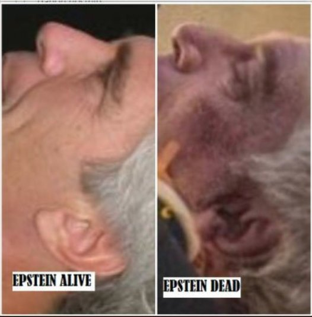
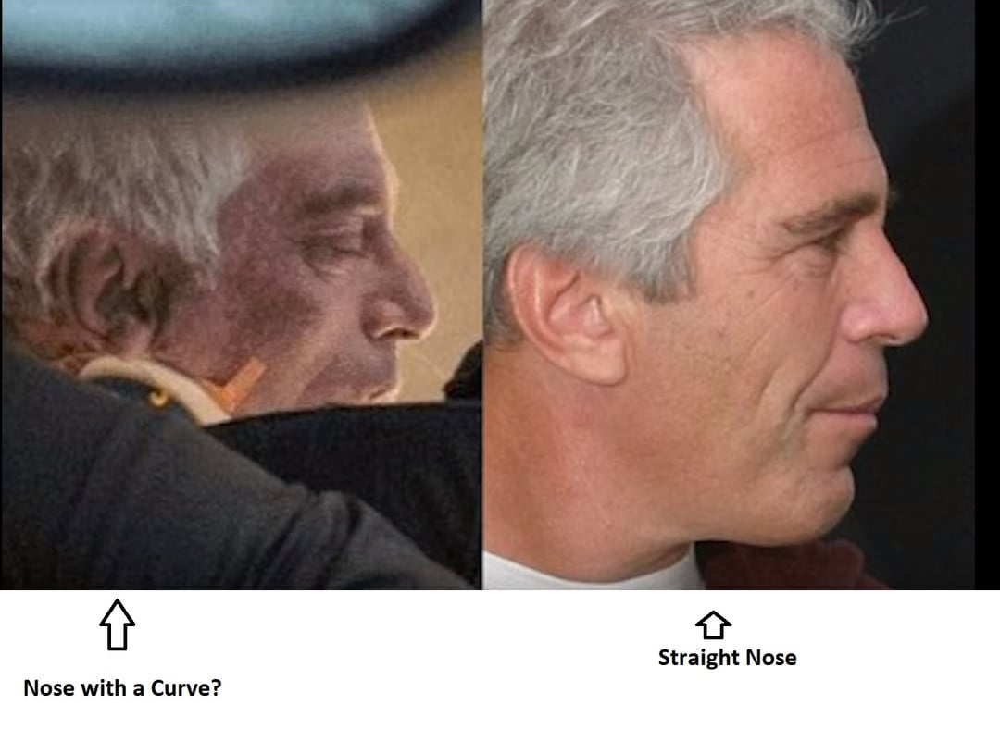
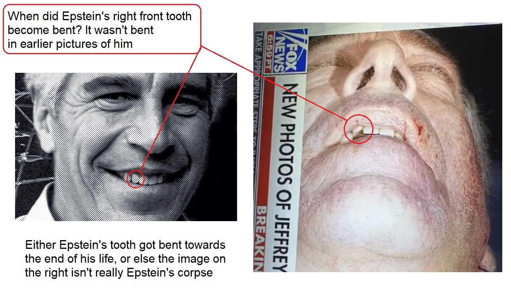
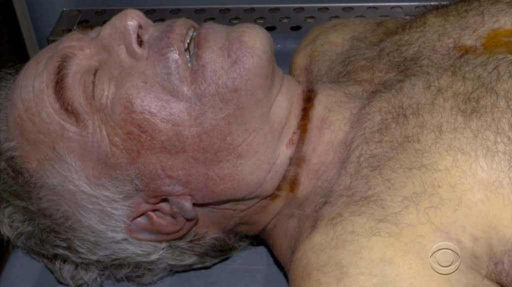

* Jeffrey Epstein was murdered.

See all the files in the repo for more information.

 * [forensic assessment PDF print](./forensic_assessment.pdf) - https://michaeldsellers.substack.com/p/epstein-a-forensic-assessment-of
 * [forensic news article PDF print (possibly with bad payload)](./forensic_news_article.pdf) - https://nypost.com/2025/08/01/us-news/questions-remain-over-jeffrey-epstein-hanging-in-prison/
 * [forensic news article PDF print (bad print; likely Palentir censorship)](./forensic_news_article_bad_capture.pdf) - same as above

The below is the same as the above but mirrored.

* The reason why his ear looked different was due to swelling, shadow, and possibly broken cartilege from earlier.

* His nose was broken prior to or on the day of his death.

* The autopsy photo in https://www.youtube.com/watch?v=9exzWqnuPmg is not of Epstein.
* Beware of everyone claiming that Jeffrey Epstein is not dead; they may be
  covering up his murder knowingly. Are they masons?

These images and files prove that Epstein was likely physically assulted (broken ear cartilege and broken nose) long before he was murdered in his cell.
