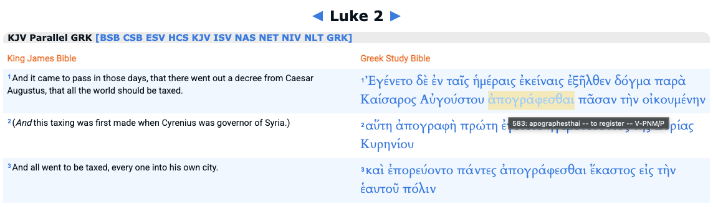

# Jesus was a Tax Protester

It is now well understood in some circles that certain translations of the
bible were promoted with the intent of deceiving its readers for mass
manipulation. Online tools such as OpenBible.com and BibleHub.com can be used
to help discern better the intended meaning and identify mistranslations, but
readers cannot easily be convinced unless they take the initiative to do the
research themselves--but most have no time or energy for such study.
Furthermore, even on OpenBible.com and BibleHub.com there still persist
systemic mistranslations and misinterpretations that have been carried on for
millennia since the time of the Roman Empire.

**The New Testament had been mistranslated to hide one of the primary reasons
why Jesus was crucified--it was because Jesus (silently) protested taxes even
while fulfilling [the prophecy of Isaiah](#prophecy-of-isaiah) and was accused
by Sanhedrin of inciting the people of biblical Israel in Judea under Roman
rule.** Despite all the sources online and the authorities at Church, this can
be verified by inspecting the facts.

> King James Version (Luke 2):
> 1: And it came to pass in those days, that there went out a decree from Caesar
>    Augustus, that **all the world should be taxed**.
> 2: (And this **taxing** was first made when Cyrenius was governor of Syria.)
> 3: And all went to be **taxed**, every one into his own city.
> 4: And Joseph also went up from Galilee, out of the city of Nazareth, into
>    Judaea, unto the city of David, which is called Bethlehem; (because he was of
>    the house and lineage of David:)
> 5: To be **taxed** with Mary his espoused wife, being great with child.

> Berean Standard Bible (Luke 2):
> (The birth of Jesus)
> 1: Now in those days a decree went out from Caesar Augustus that **a census
>    should be taken of the whole empire**.
> 2: This was the first **census** to take place while Quirinius was governor of
>    Syria.
> 3: And everyone went to his own town **to register**.
> 4: So Joseph also went up from Nazareth in Galilee to Judea, to the city of
>    David called Bethlehem, since he was from the house and line of David.
> 5: He went there to **register** with Mary, who was pledged to him in marriage and
>    was expecting a child.
> 6: While they were there, the time came for her Child to be born.
> 7: And she gave birth to her firstborn, a Son. She wrapped Him in swaddling
>    cloths and laid Him in a manger, because there was no room for them in the
>    inn.

There is a clear discrepancy between the King James Version and the Berean
Standard Bible. The former says that Joseph Jesus's parent went to Bethlehem to
get taxed. The Berean Standard Bible says that he went to get registered for a
census. What gives?

The actual word in the original Koine Greek is "apographesthai" which means
"register(ed)", not "tax(ed)".

With tools like [openbible.com](https://openbible.com/text/luke/2-2.htm) and
[biblehub.com](https://biblehub.com/p/kjv/heb/luke/2.shtml) you can compare the
translations side by side to see whether or not the translation is true.
Clearly there's a mistranslation here; and besides, "And all went to be taxed,
every one into his own city" sounds unbelievable (for otherwise why would there
be tax collectors who come to you?), whereas going to be registered makes more
sense.

So the birth of Jesus in Bethlehem got mistranslated in the King James Version
probably to get the subjects of the king to pay more taxes--this I derive
because King James [did have access to copies of the original Koine Greek
manuscripts](https://georgehguthrie.com/new-blog/manuscripts-behind-the-kjv)
and "apographo" is in Koine Greek [the 2550th most frequent
word](https://logeion.uchicago.edu/morpho/is%20the%202550th%20most%20frequent%20word)
which means "to write off, copy: to enter in a list, register"; and Martin
Luther's translation error is not so egregious, and the Latin vulgate
translation is much better; and King James had access to all of these.

This tells us more about the King James Version than anything else. What
follows is about Jesus' personal thoughts regarding taxes to the state and
church (temple). First, the famous passage about "Render therefore unto Caesar
what is Caesar's":

> King James Version (Luke 20):
> 21: And they asked him, saying, Master, we know that thou sayest and teachest
>     rightly, neither acceptest thou the person of any, but teachest the way of
>     God truly:
> 22: Is it lawful for us to give tribute [taxes] unto Caesar, or no?
> 23: But he perceived their craftiness, and said unto them, Why tempt ye me?
> 24: **Shew me a penny. Whose image and superscription hath it? They answered
>     and said, Caesar's.**
> 25: **And he said unto them, Render therefore unto Caesar the things which be
>     Caesar's, and unto God the things which be God's.**
> 26: And they could not take hold of his words before the people: **and they
>     marvelled at his answer**, and held their peace.

In the current interpretation, indeed all interpretations of Luke 20:25-26 it is
claimed that Jesus gave an astonishing answer because he agreed to pay due
taxes to Caesar. This could not be further from the truth as can be seen later
in Luke 23:

> King James Version (Luke 23):
> 2: And they began to accuse him, saying, We found this fellow perverting the
>    nation, **and forbidding to give tribute to Caesar**, saying that he himself
>    is Christ a King.

> Berean Literal bible (Luke 23):
> 2: And they began to accuse Him, saying, "We found this man subverting our
>    nation, **forbidding payment of taxes to Caesar**, and proclaiming Himself to
>    be Christ, a King."

(This detail is missing in the other books, especially Matthew, as Matthew was
a tax collector and could not be associated with a tax protester. However Luke
is a historian who studied the events post-facto and wisely decided to include
this element in his book.)

There is a logical inconsistency, as it is written in Luke that Jesus was
accused of forbidding to give tribute instead. Of course Jesus is being accused
by Sanhedrin who wanted to arrest him. But were they lying, or were they truly
afraid? I believe they were.

What Jesus meant was that Caesar can have all the pennies, while the other
silver coins of larger denominations should not be paid to Caesar. However this
is still not the complete truth, as the King James Version substituted "penny"
for what should be the "denarius", thus losing some of the required context for
understanding this passage.

A denarius was typically considered a day's wage for a common laborer in
ancient Rome. Jesus was not a common laborer and didn't have many denarius
coins. This is likely why he asked someone else to show one for
demonstration--he didn't have any on him. Also, a denarius is a smaller
denomination than a didrachma or a stater which is for tax payments for the
temple. In short, Jesus was rejecting Caesar's taxes.

> Berean Standard Bible (Luke 20):
> 19: When the scribes and chief priests realized that Jesus had spoken this
>     parable against them, **they sought to arrest Him that very hour. But they were
>     afraid of the people (so they could not yet)**.
> 20: So they watched Him closely and sent spies who pretended to be sincere.
>     They were hoping to catch Him in His words in order to hand Him over to the
>     rule and authority of the governor.
> 21: "Teacher," they inquired, "we know that You speak and teach correctly. You
>     show no partiality, but teach the way of God in accordance with the truth.
> 22: Is it lawful for us to pay taxes to Caesar or not?"
> 23: But Jesus saw through their duplicity and said to them,
> 24: "**Show Me a denarius**. Whose image and inscription are on it?" "**Caesar's**,"
>     they answered.
> 25: So Jesus told them, "**Give to Caesar what is Caesar's (denarius that have
>     Caesar's face), and to God what is God's (didrachma for Temple tax)"
> 26: And they were unable to trap Him in His words before the people; and
>     amazed at His answer, they fell silent.

The Sanhedrin scribes and priests could not arrest him until Jesus gave this
answer. Even when he gave this answer they could not immediately trap him, for
to trap him one would have to prove assertions about the personal holdings of
the denarius by Jesus and his followers; and "what is Caesar's" does not
exactly mean "only what has Caesar's face inscribed", but is only implied; and
besides to try to trap him on these points would only aid in "inciting" them to
avoid taxes, such as by asking for wages to be paid in other denominations.

While the taxes mentioned previously (Luke 20) were for Caesar, the taxes in
the following passage (Matthew 17) were for the Second Temple in Jerusalem.
There in Matthew 17 there exists clear evidence of intentional mistranslation
for the purpose of hiding Jesus' true intent of protesting taxes.

(I am not advocating for tax avoidance here, but merely pointing out the truth
that the meaning behind the Word had been hidden successfully for centuries if
not the entirety of two millennia since the first Latin translation by the Roman
Empire. It's generally not a good idea to offend authorities, even if they are
illegitimate.)

> King James Version (Matthew 17):
> 24: And when they were come to Capernaum, **they that received tribute
>     money** came to Peter, and said, Doth not your master pay **tribute**?
> 25: He saith, Yes. And when he was come into the house, Jesus prevented him,
>     saying, What thinkest thou, Simon? of whom do the kings of the earth take
>     **custom or tribute**? of their own children, or of strangers?
> 26: Peter saith unto him, Of strangers. Jesus saith unto him, **Then are the
>     children free**.
> 27: Notwithstanding, lest we should offend them, go thou to the sea, and cast
>     an hook, and take up the fish that first cometh up; and when thou hast opened
>     his mouth, thou shalt find **a piece of money**: that take, and give unto
>     them **for me and thee**.

> New International Version (Matthew 17):
> 24: After Jesus and his disciples arrived in Capernaum, **the collectors of
>     the two-drachma temple tax** came to Peter and asked, "Doesn't your teacher
>     pay the **temple tax**?"
> 25: "Yes, he does," he replied. When Peter came into the house, Jesus was the
>     first to speak. "What do you think, Simon?" he asked. "From whom do the kings
>     of the earth **collect duty and taxes**--from their own children or from
>     others?"
> 26: "From others," Peter answered. **"Then the children are exempt,"** Jesus
>     said to him.
> 27: "But so that we may not cause offense, go to the lake and throw out your
>     line. Take the first fish you catch; open its mouth and you will find **a
>     four-drachma coin**. Take it and give it to them **for my tax and yours**."

> Berean Literal Bible (Matthew 17):
> 24: And they having come to Capernaum, **those collecting the didrachmas**
>     came to Peter and said, "Does your Teacher pay the **didrachmas**?"
> 25: He says, "Yes." And he having entered into the house, Jesus anticipated
>     him, saying, "What do you think, Simon? From whom do the kings of the earth
>     receive **custom or tribute**? From their sons, or from strangers?"
> 26: And he having said, "From the strangers," Jesus said to him, **"Then the
>     sons are free"**.
> 27: But that we might not offend them, having gone to the sea, cast a hook
>     and take the first fish having come up, and having opened its mouth, you will
>     find **a stater**. Having taken that, give it to them **for Me and
>     yourself**."

Jesus paid half of what the Second Temple tax collectors demanded not because
He believed that that was God's due; on the contrary he said that the children
are free, and only paid so as to not offend them.

**"Then the children are free"!**

Even if you disagree with everything else, it cannot be denied that this is by
definition a protest of taxes from Jesus unto Peter, whether or not any taxes
were paid.

What is God's is to be rendered unto God, but the children/sons of God need not
pay taxes to any temple, church, or state. ([A son of God is one in whom another
son of God is
resurrected](https://github.com/jaekwon/ephesus/blob/main/thoughts/son_of_god_son_of_man_and_marriage.md);
as in Moses in whom Abraham, Isaac, and Jacob are resurrected, and in
Christians in whom Jesus and the martyrs are resurrected.)

Also, there are no coins that have an engraved image of God, as that is
forbidden by the ten commandments. Even if the Old Testament has laws regarding
tithing, the lesson from the bible is that there should not be a Third Temple
except one of people; the bible says not to advertise for tithe giving; and
finally, Jesus gives us the new covenant. Any son of God would naturally give
more than 10% of their worth voluntarily to where it needs to go. **No person,
temple, church, or state has the authority to nor should demand or request any
taxes, tribute, or even tithing**.

It is apparent that the Berean Literal Bible does a better job at preserving
context (the original coin denomination names) and this can be verified by
comparing each translation to the original Koine Greek, which is left as a task
to the reader.

> Berean Standard Bible (Acts 17):
> 11: "Now the Bereans were more noble-minded than the Thessalonians, for they
>     received the message with great eagerness and examined the Scriptures every
>     day to see if these teachings were true."

(Even BibleHub has issues showing the original Koine Greek text in
parallel with translations--often the Koine Greek is modified to suit the
translation. On the other hand the Berean Standard Bible (also hosted on
BibleHub) was designed to show the original Hebrew and Koine Greek and English;
you can download a free copy here https://interlinearbible.com/bib.pdf and
https://berean.bible/downloads.htm. More links to bible sites and free
software can be found at https://berean.bible/links.htm.)

It is important to preserve the original coin denomination names because only
the original names show the true intent of the Word. Jesus tells Peter to take
"a stater" to pay for both Peter and himself, which would normally be for TWO
didrachmas; but **ONE stater is equivalent to ONE didrachma**. This crucial
context is possibly missing from the bible (although it may still be hidden
somewhere in the original Hebrew or Koine Greek), and there likely exists today
and has always been an effort to hide this detail from public consciousness for
obvious reasons. For now it is known due to the decades of research by
historians and numismatics researchers and the open internet. Soon after this
paper there will be efforts to censor this information.

Notice that Wikipedia doesn't explain the relationship between a stater and a
didrachma directly. One place where stater and didrachm(a) is mentioned
together is on one specific context of the Aeginetan stater:

> https://en.wikipedia.org/wiki/Ancient_Greek_coinage:
> The three most important standards of the ancient Greek monetary system were
> the Attic standard, based on the Athenian drachma of 4.3 grams (2.8
> pennyweights) of silver, the Corinthian standard based on the stater of 8.6 g
> (5.5 dwt) of silver, that was subdivided into three silver drachmas of 2.9 g
> (1.9 dwt), and the **Aeginetan stater or didrachm** of 12.2 g (7.8 dwt), based on
> a drachma of 6.1 g (3.9 dwt).[1] The words drachm and drachma come from
> Ancient Greek, meaning 'a handful', or literally 'a grasp'.[2] Drachmae were
> divided into six obols (from the Greek word for a spit[3]), and six spits
> made a "handful".

However in the Wikipedia page for the drachma (which is half a didrachma) it is
associated with the tetradrachm as if they are equivalent. This is the false
association in many other translations of the bible that mistranslate a stater
as a "four-drachma coin", implying that Jesus asked Peter to pay the full
"didrachma/two-drachma" for each. No, Jesus asked Peter to halve the required
amount--of one stater(a)--which is equivalent to a "two-drachma coin/didrachma".

> https://en.wikipedia.org/wiki/Ancient_drachma:
> The tetradrachm ("four drachmae") coin was perhaps the most widely used coin
> in the Greek world prior to the time of Alexander the Great (along with the
> Corinthian stater).

A separate page for the stater does mention the association but also confuses
with additional language for a smaller drachma(e) unit in Corinth. At the same
time it shows the Athenian four-drachma(e) as having twice the weight of the
Athenian and Corinthian stater--it is clear that all translations of stater to
"four-drachma(e) coin" are incorrect.

## Prophecy of Isaiah

Regarding the prophecy of Isaiah 52:13-53:8:

> Berean Standard Bible (Isaiah 53):
> 7: He was oppressed and afflicted,
>      yet He did not open His mouth.
>    He was led like a lamb to the slaughter,
>      and as a sheep before her shearers is silent,
>    so **He did not open His mouth**.

This seems to go against the claim that Jesus protested taxes.
But consider the earlier portion that complements the above:

> Berean Standard Bible (Isaiah 52):
> 15: so He will sprinkle many nations.
>       **Kings will shut their mouths** because of Him.
>     For **they will see what they have not been told**,
>       and **they will understand what they have not heard**.

What is it that Jesus did not open his mouth to speak that the kings will shut
their mouths when they understand what they have not ever heard?

Recall that the Sanhedrin chief priests also shut their mouths because they
understood what was not said.

> 25: So Jesus told them, "Give to Caesar what is Caesar's, and to God what is
>     God's."
> 26: And they were unable to trap Him in His words before the people. And
>     amazed at His answer, they fell silent.

Jesus fulfilled Isaiah with a protest that didn't sound like a protest.

## The New Testament and Silver Coinage

> https://en.wikipedia.org/wiki/Stater:
> The silver stater minted at Corinth[5] of 8.6 g (0.28 ozt) weight was divided
> into three silver drachmae of 2.9 g (0.093 ozt), but was often linked to the
> Athenian silver didrachm (two drachmae) weighing 8.6 g (0.28 ozt).[6] In
> comparison, the Athenian silver tetradrachm (four drachmae) weighed 17.2 g
> (0.55 ozt).

> https://www.forumancientcoins.com/NumisWiki/view.asp?key=Stater%20vs%20Didrachm:
> What is the difference between a stater and a didrachm?
>
> This is quite an arcane subject. However, the short answer is that what
> determines when a stater is termed that, rather than a didrachm, is little
> more than popular usage.
>
> The original stater was the primary denomination of the early coinage (after
> the cessation of usage of naturally occurring electrum) in parts of Asia
> Minor and was based on a fixed weight of gold. Stater in this sense is a
> numismatic term for the primary denomination off which all other
> denominations are keyed e.g hemistater being half a stater.
>
> Coinage when initially struck in gold poor Greece was based on a primary
> denomination in silver (valued at roughly one tenth that of gold by weight).
> This occurred in Aegina with the primary denomination being a coin of 12.2 gm
> of silver. This came to be called a stater by numismatists, though what the
> ancient Greeks called it is unknown.
>
> This name sticks, although technically it could equally well be called a
> didrachm as shown in the simple summary of weight standards below from
> Morkholm's publication Early Hellenistic Coinage. The key point of this table
> is that the stater/didrachm is a primary denomination in all Greek weight
> systems, albeit with a different weight of silver being the basis of each
> system.
>
> So far so good? Then the Athenians moved to a light stater/didrachm based
> system of ca. 8.5 gm silver for the primary denomination. This is called a
> didrachm, rather than a stater by numismatists for no other reason that the
> Greek equivalent of the word drachm was what half a didrachm (or hemistater)
> was called in Athens. Thus we call an Attic weight standard tetradrachm a
> tetradrachm rather than a distater.
>
> Now to add to the confusion a stater as called by numismatists in the Attic
> Weight system reserved for a denomination in gold with a base unit weight of
> 8.6 grams.
>
> Confused? Most people (including me) are by this stage and we have yet to
> move on to the Phoenician Shekel, Persian Daric and Siglos, or the Litra of
> Sicily, which was based on a primary unit in bronze.
>
> Morkholm's Early Hellenistic Coinage has a nice summary of the evolution of
> these weight systems and a more expansive explanation can be found in the
> Preface to any of the volumes of Oliver Hoover's The Handbook of Greek Coinage.
>
> At the bottom of this thread is a more comprehensive overview of weight
> standards https://www.forumancientcoins.com/board/index.php?topic=10182.0
>
> Some nice pictures and a very high level summary of denominations can be
> found here http://www.classicalcoins.com/denominations.html
>
> This also is why we have some coins such as the Babylonian Baal/Lion coins
> called variously lion staters or tetradrachms, sometimes simultaneously in the
> one publication!
>
> Similarly you will see Carthaginian coins described as 1 1/2 Shekels or
> Tridrachms... not much sense in either case as we have no idea what they were
> really called. The Carthaginians being of Phoenician extraction, I suspect they
> were originally struck by the Carthaginians with a lower silver to gold value
> than the Phoenician Shekel, reflecting Carthage's original gold based economy,
> prominence and wealth, and were called a shekel by the Carthaginians despite
> being 50% heavier that the Phoenician silver shekel.
>
> **Table 1. Eastern Hellenistic coin standards (The weights are given in grams.)**
>
> |Standard|Tetradrachm|Didrachm|Drachm|Hemidrachm|
> |Aeginetan|-|12.2|6.1|3.05|
> |Reduced Aeginetan (Corcyrean)|-|11.5 - 10.0|5.75 - 5.0|2.8 - 2.5|
> |Persian|-|11.2|5.6|2.8|
> |Attic|17.3 - 16.18|8.65 - 8.4|4.3 - 4.2|2.15 - 2.1|
> |Chian|15.6|7.8|3.9|-|
> |Ptolemaic|14.3|7.15|3.55|-|
> |Rhodian|13.6 - 13.4|6.8 - 6.7|3.4|-|
> |Cistophoric|12.6|6.3|3.15|-|

 * **lepton (widow's mite)**: Mark 12:42, Luke 12:59, 21:2
 * **drachma**: Luke 15:8 - Cappadocian drachma
 * **denarius (day's wages)**: Matthew 18:28; 20:1-16; 22:19; Mark 6:37; 12:15;
   14:5; Luke 7:41; 10:35; 20:24; John 6:7; 12:5; Rev. 6:6 - equivalent to the
   drachma; Caesar's head; typical day's wage for a common laborer in ancient
   Rome.
 * **didrachma**: Matthew 17:24 - mistranslated to "tribute coin"
 * **stater/statera (statera)**: Matthew 17:27 - interchangeable w/ didrachma
 * **Tyre shekel (Temple tax)**: Exodus 30:13 (Money Changers), John 2:15,
   Matthew 21:12 (Peter's Fish), Matthew 17:27 (Judas' 30 coins) Matthew 26:15

// shekel : denarius : talent :: Jewish : Greek : Roman

> https://cdn.bakerpublishinggroup.com/processed/esource-assets/files/2058/original/1.2.Coins_Mentioned_in_the_New_Testament.pdf?1525364484:
> **denarius**: This silver coin was the usual day's wage for a typical
> laborer (see Matt. 18:28; 20:1-16; 22:19; Mark 6:37; 12:15; 14:5;
> Luke 7:41; 10:35; 20:24; John 6:7; 12:5; Rev. 6:6). **The denarius (a
> Roman coin) appears to have been roughly equivalent in value to the
> drachma (a Greek coin). The "lost coin" in the parable that Jesus
> tells in Luke 15:8-10 is a drachma**.

## KJV, Luther, and Latin on Taxation

> Martin Luther Bibel 1912 (Luke 2):
> 1: Es begab sich aber zu der Zeit, dass ein Gebot von dem Kaiser Augustus
>    ausging, dass alle Welt **geschatzt** wurde.
> 2: Und diese **Schatzung** war die allererste und geschah zu der Zeit, da
>    Cyrenius Landpfleger von Syrien war.
> 3: Und jedermann ging, dass er sich **schatzen** liesse, ein jeglicher in seine
>    Stadt.
> 4: Da machte sich auch auf Joseph aus Galilaa, aus der Stadt Nazareth, in das
>    judische Land zur Stadt Davids, die da heisst Bethlehem, darum dass er von dem
>    Hause und Geschlechte Davids war,
> 5: auf dass er sich **schatzen** liesse mit Maria, seinem vertrauten Weibe, die
>    ward schwanger.
> 6: Und als sie daselbst waren, kam die Zeit, da sie gebaren sollte.
> 7: Und sie gebar ihren ersten Sohn und wickelte ihn in Windeln und legte ihn
>    in eine Krippe; denn sie hatten sonst keinen Raum in der Herberge.

Roughly translates to:

> 1: And it came to pass at that time that a commandment went forth from Caesar
>    Augustus, that all the world should be **esteemed (valued)**.
> 2: And this **estimate** was the very first and happened at the time when
>    Cyrenius was governor of Syria.
> 3: And every one went to be **valued**, every one to his own city.
> 4: Then Joseph also went out of Galilee, out of the city of Nazareth, into
>    the land of Judea, to the city of David, which is called Bethlehem, because
>    he was of the house and lineage of David,
> 5: that he might be **valued** with Mary, his trusted wife, who became pregnant.
> 6: And when they were there, the time came for her to give birth.
> 7: And she gave birth to her first son, and wrapped him in
>    swaddling clothes, and laid him in a manger; for they had no other room in the
>    inn.

The root of all four words in German are the same "schatz", and mean
"estimation" or "value". This translation sort of makes sense for a census
because a census cannot be perfect, but is very different in meaning than the
original Koine Greek based on its roots: apographo, to write off, copy: to enter
in a list, register, which is a precise atomical thing.

So Martin Luther first made the error of **estimating** the word "registration"
to "estimate", or rather fudged it; not exactly to "taxation", but closer to
it. And then King James completed the error of mistranslating it to "taxation".

> [Latin Vulgate Bible](https://github.com/LukeSmithxyz/vul) (Luke 2):
> 1: Factum est autem in diebus illis, exiit edictum a Caesare Augusto ut
>    **describeretur** universus orbis.
> 2: Haec **descriptio** prima facta est a praeside Syriae Cyrino :
> 3: et ibant omnes ut **profiterentur** singuli in suam civitatem.
> 4: Ascendit autem et Joseph a Galilaea de civitate Nazareth in Judaeam, in
>    civitatem David, quae vocatur Bethlehem : eo quod esset de domo et familia
>    David,
> 5: ut **profiteretur** cum Maria desponsata sibi uxore praegnante.
> 6: Factum est autem, cum essent ibi, impleti sunt dies ut pareret.
> 7: Et peperit filium suum primogenitum, et pannis eum involvit, et reclinavit
>    eum in praesepio : quia non erat eis locus in diversorio.

In Latin "descriptio" means "description", while "profiterentur" means "they
would register". This seems like a better translation than either Martin
Luther's or King James'.
