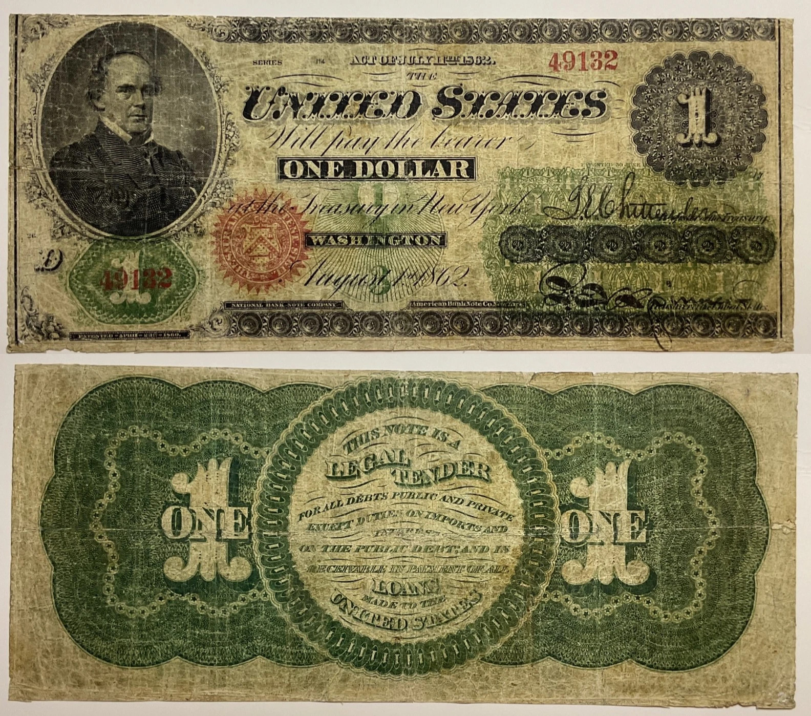
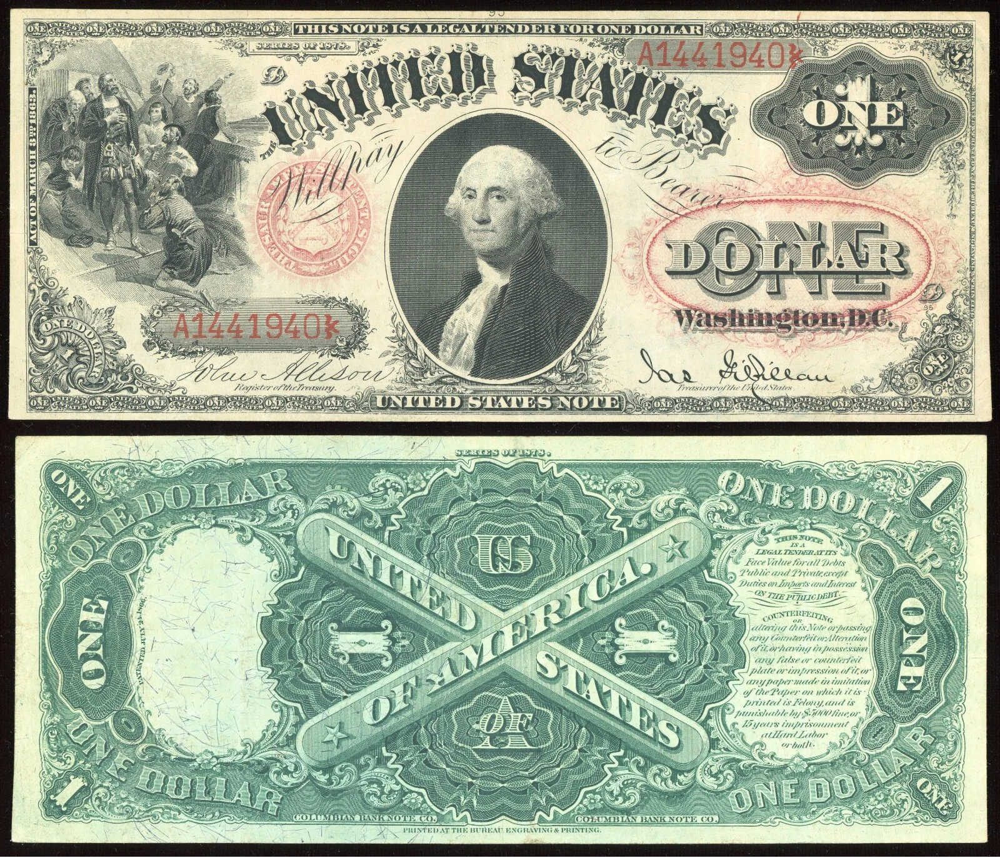
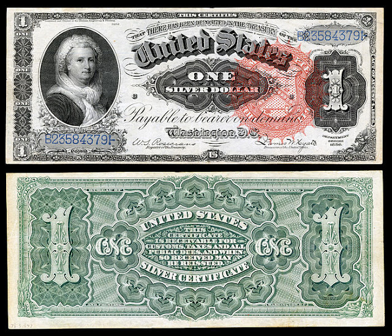
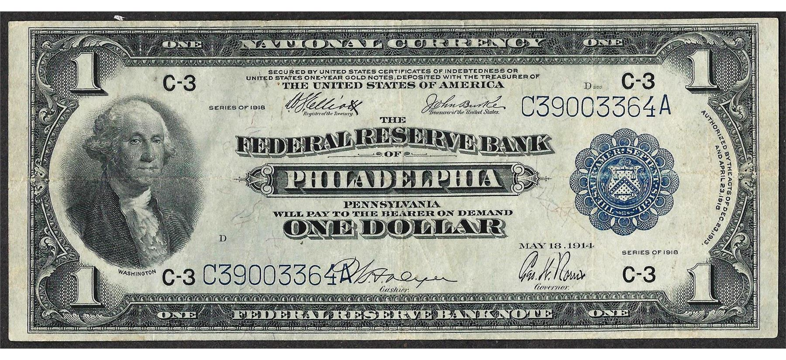
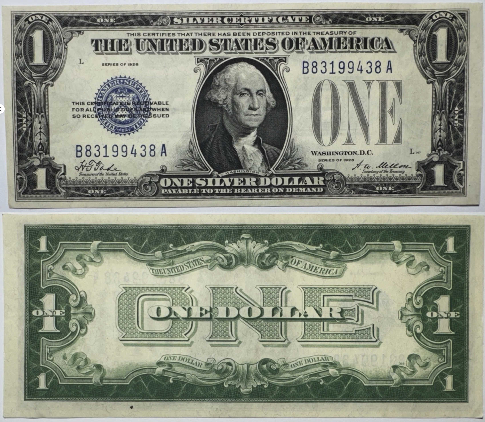
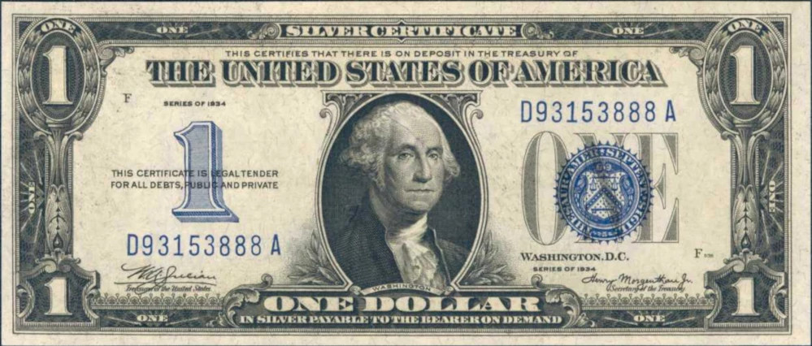
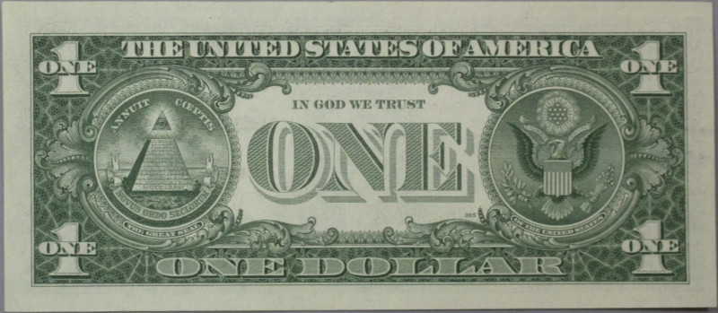
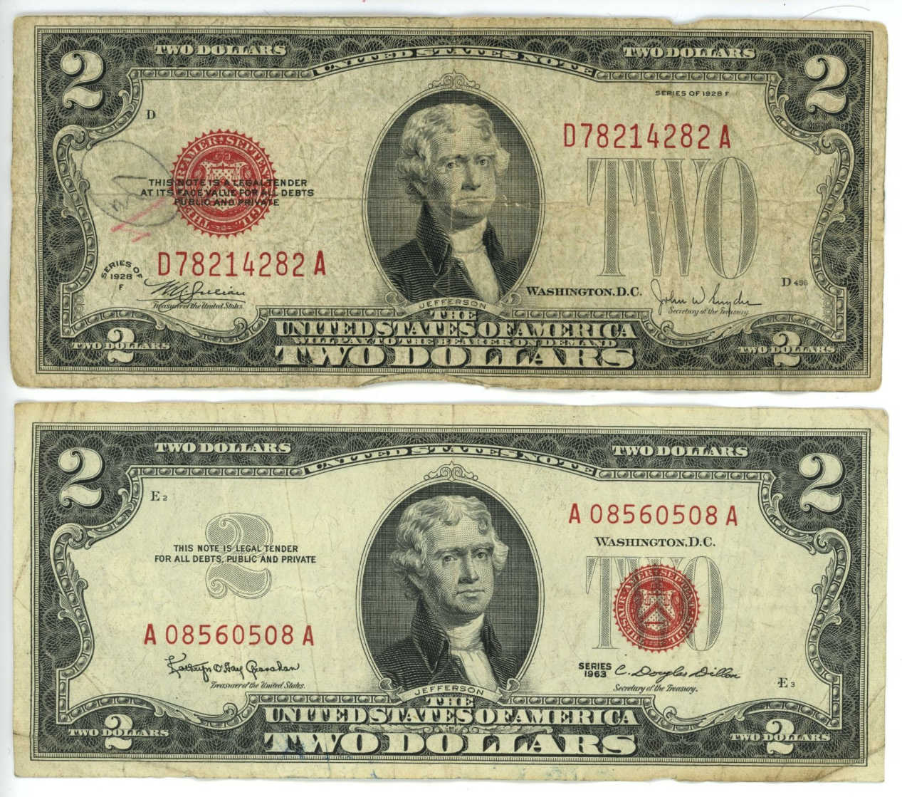
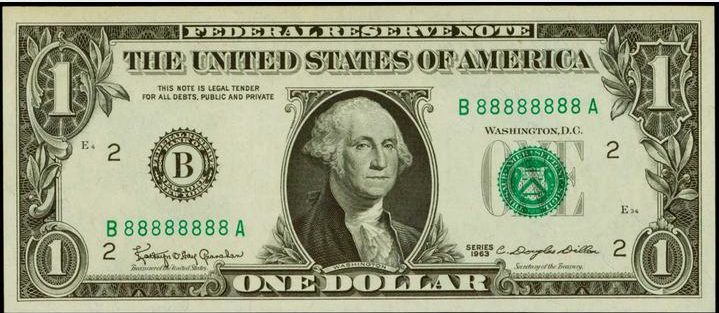

# The U.S. Dollar, Silver, and Gold

## The History of U.S. Silver Coins

_from Duck.ai_

Overview of U.S. Silver Coins

The history of U.S. silver coins began with the establishment of the U.S. Mint
in 1792. Before this, various foreign and domestic coins circulated in America.
The Coinage Act of 1792 set the U.S. dollar based on a fixed weight of silver,
leading to the minting of silver coins.

### Early Silver Coins

Initial Minting
 * 1794: The first U.S. silver coin, the Flowing Hair dollar, was minted.
 * 1795: The Draped Bust dollar followed, featuring Lady Liberty.
 * 1836-1839: The Gobrecht dollar was introduced, showcasing a seated Liberty design.

Popular Designs
 * Morgan Dollar (1878-1904): Designed by George T. Morgan, this coin became
   iconic, featuring Lady Liberty on the obverse and an eagle on the reverse.
 * Peace Dollar (1921-1935): Created to symbolize peace after World War I, it
   featured a new design of Liberty.

Changes in Composition
 * 90% Silver Coins
 * Prior to 1965, U.S. dimes, quarters, and half dollars contained 90% silver.
 * The Coinage Act of 1965 eliminated silver from dimes and quarters and reduced the silver content in half dollars to 40%.

Junk Silver
 * Coins minted before 1965 are often referred to as "junk silver" due to their
   higher intrinsic silver value compared to their face value. These include
   pre-1965 dimes, quarters, and half dollars.

Modern Silver Coins
 * Today, the U.S. Mint produces silver bullion coins, such as the American
   Silver Eagle, which contains one troy ounce of .999 fine silver. Silver
   coins remain popular among collectors and investors for their historical
   significance and intrinsic value.
 * _(Jae:) However, these are still technically US dollars and new laws may be
   introduced at any time to prevent the melting of these dollars; so it is in
   some sense safer to acquire "silver rounds" that are not minted by the U.S.
   Mint. For example, the "Morgan Dollar Design" silver rounds sold at
   Apmex.com are 99.9% silver and have no mention of the term "dollar"_.

## The History of the One Dollar Bill

_Originally from http://www.onedollarbill.org/history.html with my words in
italics, and images included from my own research._

_This omits the original Continental Currency dollar of the Continental
Congress which adopted the Declaration of Independence on July 4th, 1776; and
dissolved on March 1, 1781, when the Articles of Confederation came into force,
establishing a new national government for the United States._

Although experiments with paper money did occur throughout the early history of
the country, they were largely unsuccessful. People, for good reason, didn't
trust the notes and preferred gold and silver coin. In 1861, needing money to
finance the Civil War, Congress authorized the issuance of Demand notes in $5,
$10 and $20 denominations. The Demand notes were so named because they were
redeemable in coin "on demand." The notes were nicknamed Greenbacks, a name
which is still in use today to refer to United States currency.

The first $1 bill was issued in 1862 as a Legal Tender Note with a portrait of
Salmon P. Chase, the Treasury Secretary under President Abraham Lincoln.

The National Banking Act of 1863 established a national banking system and a
uniform national currency. Banks were required to purchase U.S. government
securities as backing for their National Bank Notes. Although United States
Notes were still widely accepted, most paper currency circulating between the
Civil War and World War I were National Bank Notes. They were issued from 1863
through 1932. From 1863 to 1877 National Bank Notes were printed by private
bank note companies under contract to the Federal government. The Federal
government took over printing them in 1877.

Gold certificates, were first issued in 1863 and put into general circulation
in 1865. The severe economic crisis of the 1930s - better known as the Great
Depression - resulted in runs on the banks and demands by the public for gold.
In 1934 all Gold Certificates were called in from the Federal Reserve Banks and
between the years 1934 and 1974 it was illegal for US Citizens to hold gold
bullion or certificates.

Silver certificates were first issued in exchange for silver dollars in 1878.
For many years silver certificates were the major type of currency in
circulation. However, in the early 1960s when rising silver prices threatened
to undermine the currency system, Congress eliminated silver certificates and
also discontinued the use of silver in circulating coinage such as dimes and
quarters.

**The current design of the United States one dollar bill ($1) technically
dates to 1963 when the bill became a Federal Reserve Note as opposed to a
Silver Certificate**. However, many of the design elements that we associate
with the bill were established in 1929 when all of the country's currency was
changed to its current size. Collectors call today's notes "small size notes"
to distinguish them from the older, larger formats. The most notable and
recognizable element of the modern one dollar bill is the portrait the first
president, George Washington, painted by Gilbert Stuart.

The one dollar bill issued in 1929 (under Series of 1928) was a silver
certificate. The treasury seal and serial numbers on it were dark blue. The
reverse had a large ornate ONE superimposed by ONE DOLLAR. These $1 Silver
Certificates were issued until 1934.

In 1933, $1 United States Notes were issued to supplement the supply of $1
Silver Certificates. Its treasury seal and serial numbers were red. Only a
small number of these $1 bills entered circulation and the rest were kept in
treasury vaults until 1949 when they were issued in Puerto Rico.

In 1934, under Washington's portrait, the words ONE SILVER DOLLAR were changed
to ONE DOLLAR due to the fact that Silver Certificates could be redeemed for
silver bullion. The treasury seal was moved to the right and superimposed over
ONE, and a blue numeral 1 was added to the left.

In 1935, design changes included changing the blue numeral 1 to gray, the
treasury seal was made smaller and superimposed by WASHINGTON D.C., and a
stylized ONE DOLLAR was added over the treasury seal. The reverse was also
changed to its current design, except for the absence of IN GOD WE TRUST.

The World War II years featured several special printings including the Hawaii
overprints. The Government was concerned that Hawaii might be lost to the
Japanese and wanted to be able to devalue the money should this invasion occur.

In 1957 the $1 bill became the first U.S. currency to bear the motto IN GOD WE
TRUST.

In 1963 production of one dollar Federal Reserve Notes began to replace the $1
Silver Certificate. The border design on the front was completely redesigned
and the serial numbers and treasury seal were printed in green ink.

_1962 was a transition year when "will pay to the bearer on demand" was no longer printed._

In 1969 the $1 bill began using the new treasury seal with wording in English
instead of Latin.

## On Fort Knox Gold

_By [twitter.com/@WallStreetApes Feb 16, 2026](https://x.com/WallStreetApes/status/1891237363222761557)_

Biggest story of the day: Senator Rand Paul is calling for an audit on Fort
Knox to ensure the 4,580 tons US gold is still there.

Here's what you were NEVER TOLD about the gold at Fort Knox.

America's Wealth, The largest fortune in the history of the world, was stolen.
The Fort Knox Gold Robbery:

An article was written connecting Rockefeller Family and The Federal Reserve.

3 days later the source was thrown out of a window to her death.

"So just how did the story of the Fort Knox gold robbery get out? It all
started with an article in a New York periodical in 1974. The article charged
that the Rockefeller family was manipulating the federal reserve to sell off
Fort Knox Gold at bargain basement prices to anonymous European speculators. 3
days later, the anonymous source of the story, Louise Auchincloss Boyer,
mysteriously fell to her death from the window of her 10th floor apartment in
New York. How would missus Boyer have known of the Rockefeller connection to
the Fort Knox Gold Heist?

She was the long time secretary of Nelson Rockefeller. For the next 14 years,
this man, Ed Durell, a wealthy Ohio industrialist, devoted himself to a quest
for the truth concerning the Fort Knox gold. He wrote thousands of letters to
over 1,000 government and banking officials trying to find out how much gold
was really left and where the rest of it had gone.

Edith Roosevelt, the granddaughter of president Teddy Roosevelt, questioned the
actions of the government in a March 1975 edition of the New Hampshire Sunday
news.

-- Unfortunately, Ed Durell never did accomplish his primary goal, a full audit
of the gold reserves in Fort Knox. It's incredible that the world's greatest
treasure has had little accounting or auditing. This goal belonged to the
American people, not the Federal Reserve and their foreign owners.

One thing is certain, the government could blow all of this speculation away in
a few days with a well publicized audit under the searing lights of media
cameras. It has chosen not to do so. One must conclude that they are afraid of
the truth such an audit would reveal. What is the government so afraid of?
Here's the answer:

When president Ronald Reagan took office in 1981, his conservative friends
urged him to study the feasibility of returning to a gold standard as the only
way to curb government spending. It sounded like a reasonable alternative, so
President Reagan appointed a group of men called the Gold Commission to study
the situation and report back to Congress. What Reagan's Gold Commission
reported back to Congress in 1982 was the following shocking revelation
concerning gold. The US Treasury owned no gold at all.

All the gold that was left in Fort Knox was now owned by the Federal Reserve, a
group of private bankers, as collateral against the national debt.

The truth of the matter is that never before has so much money been stolen from
the hands of the general public and put into the hands of a small group of
private investors, the money changers"

## See Also

 * [Jesus was a Tax Protester](../jesus_and_taxes) -- biblical mistranslations of taxation, silver coinage in the New Testament, and Jesus' silent protest
